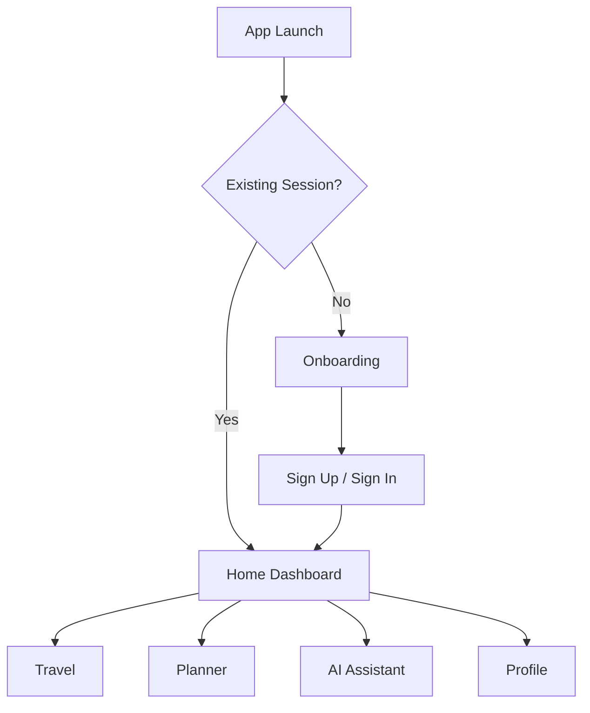
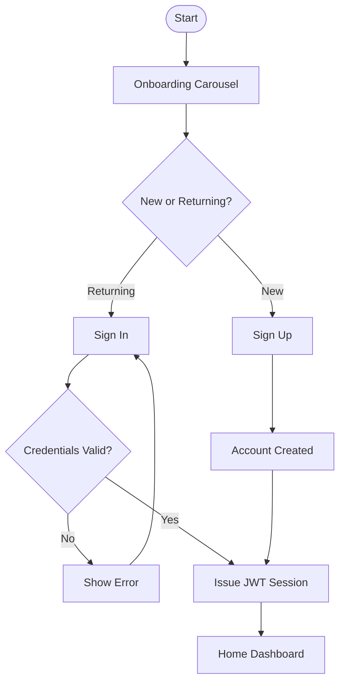
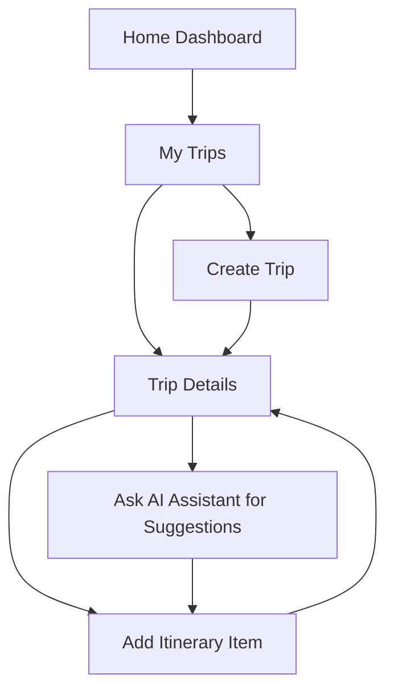
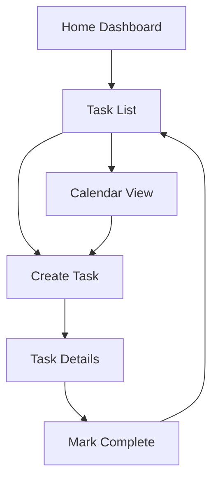
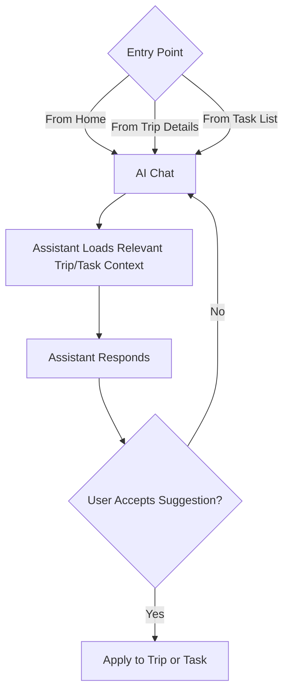

# User Flow

## Document Information

| Field | Value |
| --- | --- |
| Document | User Flow |
| Status | Draft |
| Version | 1.0.0 |
| Last Updated | 2026-07-16 |
| Owner | Product & Design |

## Table of Contents

- [Purpose](#purpose)
- [Flow Overview](#flow-overview)
- [Entry Points](#entry-points)
- [Core Flows](#core-flows)
- [Edge Cases](#edge-cases)
- [Exit Points](#exit-points)
- [Notes](#notes)

## Purpose

This document maps how users move through LifeOS, from first launch through daily use of each module. It bridges the personas in [03-user-personas.md](03-user-personas.md) and the concrete screens catalogued in [05-screen-inventory.md](05-screen-inventory.md).

## Flow Overview

At the highest level, a user either arrives as a new user (onboarding and account creation) or a returning user (sign-in), lands on the Home Dashboard, and from there moves into one of the four main modules: Travel, Planner, AI Assistant, or Profile.

## Entry Points

| Entry Point | Description |
| --- | --- |
| Cold launch, no session | User has never signed in, or a prior session expired/was logged out. Routes to Onboarding. |
| Cold launch, valid session | A valid JWT session exists locally. Routes directly to Home Dashboard. |
| Push notification (future) | Deep-links into a specific Trip, Task, or AI conversation. Tracked as a roadmap item in [11-roadmap.md](11-roadmap.md). |

## Core Flows

### Authentication Flow

Related requirements: [07-functional-requirements.md#authentication](07-functional-requirements.md#authentication). Related screens: [05-screen-inventory.md#authentication](05-screen-inventory.md#screen-list).

### Trip Planning Flow (Travel Module)

Related requirements: [07-functional-requirements.md#travel](07-functional-requirements.md#travel). Related AI behavior: [09-ai-features.md](09-ai-features.md).

### Task Planning Flow (Planner Module)

Related requirements: [07-functional-requirements.md#planner](07-functional-requirements.md#planner).

### AI Assistant Flow

Related requirements: [09-ai-features.md](09-ai-features.md).

## Edge Cases

| Edge Case | Expected Behavior |
| --- | --- |
| Expired or revoked JWT session | User is redirected to Sign In; in-progress unsaved input is preserved locally where feasible. |
| Network unavailable during AI request | AI Assistant surfaces a clear error state and allows retry; no partial or fabricated response is shown. |
| Creating a task or trip with missing required fields | Inline validation blocks submission before a request is sent to the backend. |
| Deleting a trip or task list with existing items | User is prompted to confirm before the soft delete is applied (see [14-database-design.md#entities](14-database-design.md#entities)). |

## Exit Points

| Exit Point | Description |
| --- | --- |
| Sign Out | Clears the local session and JWT, returns the user to the Authentication entry point. |
| App Backgrounded | Session persists; no explicit exit flow required. |
| Account Deletion (future) | Tracked in [11-roadmap.md](11-roadmap.md); not part of the current scope. |

## Notes

Flows describe intended navigation, not visual design. Visual treatment of each screen is defined in [06-design-system.md](06-design-system.md) and [05-screen-inventory.md](05-screen-inventory.md).
