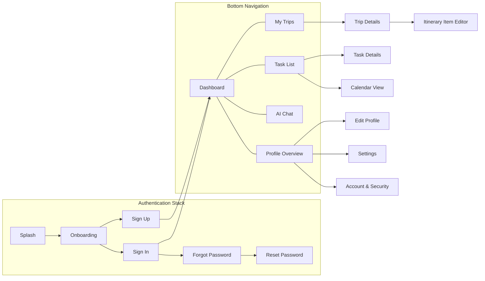

# Screen Inventory

## Document Information

| Field | Value |
| --- | --- |
| Document | Screen Inventory |
| Status | Draft |
| Version | 1.0.0 |
| Last Updated | 2026-07-16 |
| Owner | Product & Design |

## Table of Contents

- [Purpose](#purpose)
- [Screen List](#screen-list)
- [Screen Details](#screen-details)
- [Navigation Map](#navigation-map)
- [Notes](#notes)

## Purpose

This document catalogues every screen in LifeOS, grouped by module, and defines how they connect. It is the bridge between the flows in [04-user-flow.md](04-user-flow.md) and the visual language defined in [06-design-system.md](06-design-system.md). Visual references for these screens originate from the Stitch designs in `design/stitch/`; this inventory is the textual source of truth for scope and naming.

## Screen List

### Authentication

| Screen | Description |
| --- | --- |
| Splash | Initial launch screen; determines session state and routes accordingly. |
| Onboarding | Introductory carousel presenting the LifeOS value proposition. |
| Sign In | Email/password sign-in. |
| Sign Up | New account creation. |
| Forgot Password | Initiates a password reset request. |
| Reset Password | Sets a new password from a reset link/code. |

### Home Dashboard

| Screen | Description |
| --- | --- |
| Dashboard | The main landing screen after sign-in; surfaces upcoming trips, today's tasks, and AI-curated highlights. |

### AI Assistant

| Screen | Description |
| --- | --- |
| AI Chat | Conversational interface with the Gemini-powered assistant. |
| AI Conversation History | List of past AI conversations. |

### Travel

| Screen | Description |
| --- | --- |
| My Trips | List of the user's trips, grouped by status (upcoming, ongoing, past). |
| Trip Details | Itinerary and details for a single trip. |
| Create / Edit Trip | Form to create a new trip or edit an existing one. |
| Itinerary Item Editor | Form to add or edit a single itinerary item within a trip. |

### Planner

| Screen | Description |
| --- | --- |
| Task List | List of tasks, filterable by list/status. |
| Calendar View | Calendar-based view of tasks with due dates/times. |
| Task Details | Details for a single task. |
| Create / Edit Task | Form to create a new task or edit an existing one. |

### Profile

| Screen | Description |
| --- | --- |
| Profile Overview | Summary of the user's profile information. |
| Edit Profile | Form to edit display name, avatar, and related fields. |
| Settings | App preferences (theme, notifications, locale). |
| Account & Security | Password change and active session management. |

## Screen Details

| Screen | Module | Primary Entry Point | Primary Actions |
| --- | --- | --- | --- |
| Splash | Authentication | App launch | Route to Dashboard or Onboarding |
| Onboarding | Authentication | Splash (no session) | Continue to Sign Up / Sign In |
| Sign In | Authentication | Onboarding, Sign Up | Submit credentials, navigate to Forgot Password |
| Sign Up | Authentication | Onboarding, Sign In | Submit registration |
| Forgot Password | Authentication | Sign In | Submit reset request |
| Reset Password | Authentication | Reset link/code | Submit new password |
| Dashboard | Home Dashboard | Sign In/Up success | Navigate to any module |
| AI Chat | AI Assistant | Dashboard, Trip Details, Task List | Send message, apply suggestion |
| AI Conversation History | AI Assistant | AI Chat | Resume a past conversation |
| My Trips | Travel | Dashboard, bottom navigation | Open trip, create trip |
| Trip Details | Travel | My Trips, Dashboard | Add itinerary item, ask AI, edit trip |
| Create / Edit Trip | Travel | My Trips | Save trip |
| Itinerary Item Editor | Travel | Trip Details | Save itinerary item |
| Task List | Planner | Dashboard, bottom navigation | Open task, create task, switch to calendar |
| Calendar View | Planner | Task List | Open task, create task |
| Task Details | Planner | Task List, Calendar View | Edit task, mark complete |
| Create / Edit Task | Planner | Task List, Calendar View | Save task |
| Profile Overview | Profile | Bottom navigation | Navigate to Edit Profile, Settings, Security |
| Edit Profile | Profile | Profile Overview | Save profile changes |
| Settings | Profile | Profile Overview | Toggle preferences |
| Account & Security | Profile | Profile Overview | Change password, review sessions, sign out |

## Navigation Map

The primary navigation is a bottom navigation bar with five destinations; Authentication is a separate pre-login stack.

## Notes

Screen names in this inventory are the canonical names to be used in code (Composable/route names), design files, and QA test cases. Any renaming should be reflected here first.
