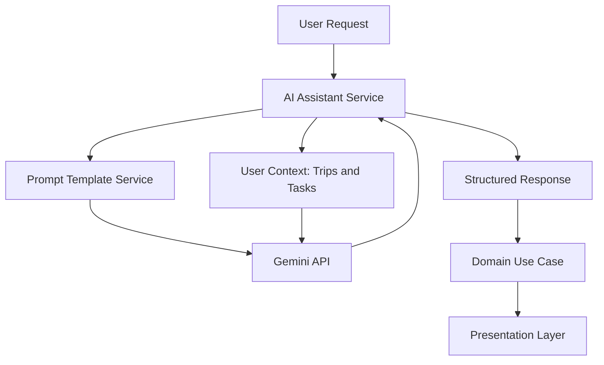

# AI Features

## Document Information

| Field | Value |
| --- | --- |
| Document | AI Features |
| Status | Draft |
| Version | 1.1.0 |
| Last Updated | 2026-07-16 |
| Owner | Engineering – AI |

## Table of Contents

- [Purpose](#purpose)
- [Feature Overview](#feature-overview)
- [AI Capabilities](#ai-capabilities)
- [Data Requirements](#data-requirements)
- [Model Considerations](#model-considerations)
- [Limitations](#limitations)
- [Notes](#notes)

## Purpose

This document defines how AI, powered by the Gemini API, is integrated across LifeOS. It implements the [AI Integration Rules](../CLAUDE.md#ai-integration-rules) defined in `CLAUDE.md` and provides the detail behind the AI-related requirements in [07-functional-requirements.md](07-functional-requirements.md#ai-assistant).

## Feature Overview

AI in LifeOS is not confined to a single chat screen. It is a cross-cutting capability surfaced in four places:

| Surface | Behavior |
| --- | --- |
| AI Assistant (dedicated) | Free-form conversation with the assistant, aware of the user's trips and tasks. |
| Home Dashboard | A short, AI-curated highlight summarizing what matters today (FR-HOME-03). |
| Travel | AI-generated itinerary suggestions for a trip (FR-TRAVEL-05). |
| Planner | AI-assisted task suggestions surfaced through the AI Assistant when invoked from the Task List. |

## AI Capabilities

| Capability | Description |
| --- | --- |
| Conversational assistance | Users can ask free-form questions and receive contextual answers. |
| Trip itinerary suggestions | Given a trip's destination and dates, the assistant proposes itinerary items the user can accept or discard. |
| Task-aware daily highlight | The assistant summarizes the user's day using their tasks and trips as input. |
| Suggestion application | Accepted suggestions are converted into real Trip/ItineraryItem or Task records through the normal domain use cases — never written directly by the AI layer. |

## Data Requirements

- The AI module reads only the requesting user's own trips, itinerary items, and tasks — no cross-user data is ever included in a prompt.
- Data passed to Gemini is limited to what is relevant to the specific request (e.g., a single trip's destination and dates for itinerary suggestions), not the user's entire history.
- Conversations and messages are persisted (see [14-database-design.md](14-database-design.md#entities)) so users can review AI Conversation History (FR-AI-03).

## Model Considerations

- All AI functionality is implemented against the Gemini API, per [CLAUDE.md](../CLAUDE.md#tech-stack).
- The AI integration is isolated behind a dedicated backend module (an "AI module") so the Gemini API is the only integration point with the model provider; no other module calls the Gemini API directly.
- Prompt templates are defined once, stored centrally, and reused across features (e.g., one itinerary-suggestion template used by both the Travel module's AI entry point and the AI Assistant conversation), per [CLAUDE.md](../CLAUDE.md#ai-integration-rules).
- Business logic — deciding what to do with an AI suggestion (e.g., creating an ItineraryItem) — lives in domain use cases, not inside the AI module or the prompt/response handling code.
- The concrete provider-abstraction design, prompt/context management, rate limiting, retry, and circuit-breaker mechanics are defined in [12-project-architecture.md](12-project-architecture.md#ai-integration-architecture).

## Limitations

- The AI Assistant must never directly modify UI state or persisted data; it returns suggestions that flow through the same domain use cases as any user-initiated action, per [CLAUDE.md](../CLAUDE.md#ai-integration-rules).
- AI responses are not treated as guaranteed-accurate; itinerary and task suggestions always require explicit user acceptance before being persisted (FR-AI-04, FR-TRAVEL-05).
- If the Gemini API is unavailable or times out, the AI Assistant surfaces a clear error state; core Travel and Planner functionality must remain usable per [08-non-functional-requirements.md](08-non-functional-requirements.md#reliability) and the error-handling/circuit-breaker strategy in [12-project-architecture.md](12-project-architecture.md#error-handling).

## Notes

Advanced AI capabilities beyond conversational assistance and suggestion generation (e.g., proactive notifications, automatic schedule optimization) are tracked as future phases in [11-roadmap.md](11-roadmap.md), not part of the current AI feature set.
