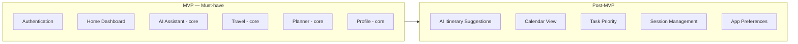

# MVP

## Document Information

| Field | Value |
| --- | --- |
| Document | MVP |
| Status | Draft |
| Version | 1.0.0 |
| Last Updated | 2026-07-16 |
| Owner | Product & Engineering |

## Table of Contents

- [Purpose](#purpose)
- [MVP Definition](#mvp-definition)
- [Core Features](#core-features)
- [Out of Scope](#out-of-scope)
- [Success Metrics](#success-metrics)
- [Notes](#notes)

## Purpose

This document defines the Minimum Viable Product for LifeOS: the smallest set of functionality across all six modules that still delivers on the vision in [02-product-vision.md](02-product-vision.md) — travel planning, task management, scheduling, and AI assistance working together.

## MVP Definition

The vision explicitly combines travel planning, task management, intelligent scheduling, and AI assistance "into one ecosystem." Because the integration between modules is the core value proposition, the MVP includes all six modules at a **core** level of functionality rather than deferring any entire module to a later phase. Advanced or "intelligent" behaviors (proactive suggestions, automated scheduling) are deferred to [11-roadmap.md](11-roadmap.md); basic, user-initiated functionality in each module ships in the MVP.

## Core Features

The MVP includes every requirement marked **Must** in [07-functional-requirements.md](07-functional-requirements.md):

| Module | MVP Scope |
| --- | --- |
| Authentication | Sign up, sign in, sign out, password reset, JWT session management. (FR-AUTH-01 – FR-AUTH-06) |
| Home Dashboard | Today's tasks and upcoming trip(s) displayed; navigation to all modules. (FR-HOME-01, FR-HOME-02, FR-HOME-04) |
| AI Assistant | Conversational assistant aware of the user's own trips and tasks, reachable from Home, Trip Details, and Task List. (FR-AI-01, FR-AI-02, FR-AI-05) |
| Travel | Create/edit/delete trips, manage itinerary items, soft-deletable trips. (FR-TRAVEL-01 – FR-TRAVEL-04, FR-TRAVEL-06) |
| Planner | Create/edit/delete tasks, organize into task lists, mark complete. (FR-PLANNER-01 – FR-PLANNER-03, FR-PLANNER-05) |
| Profile | View/edit profile, change password. (FR-PROFILE-01 – FR-PROFILE-03) |

## Out of Scope

The following are explicitly **not** part of the MVP and are tracked in [11-roadmap.md](11-roadmap.md):

- AI-generated trip itinerary suggestions (FR-TRAVEL-05) and AI conversation history (FR-AI-03) — **Should**-priority items deferred past the initial release.
- Calendar view for tasks (FR-PLANNER-04) and task priority (FR-PLANNER-06).
- App preference configuration (FR-PROFILE-04) and session visibility/revocation (FR-PROFILE-05).
- Applying AI suggestions directly into Trip/Task records (FR-AI-04) — MVP AI Assistant is conversational only, without write-back actions.
- Any multi-user, sharing, or collaboration functionality.
- Push notifications and deep-linking.

## Success Metrics

| Metric | Target |
| --- | --- |
| Account creation to first Trip or Task created | A new user creates at least one Trip or Task within their first session. |
| AI Assistant engagement | A new user sends at least one message to the AI Assistant within their first week. |
| Core flow completion rate | Users who start creating a trip or task complete it (no abandonment) at a healthy rate, to be baselined post-launch. |
| Crash-free sessions | No regressions against the reliability targets in [08-non-functional-requirements.md](08-non-functional-requirements.md#reliability). |

Specific numeric baselines will be set once the MVP is instrumented and initial usage data exists; this document should be updated at that point rather than left with placeholder targets indefinitely.

## Notes

MVP scope is derived directly from the **Must**-priority rows in [07-functional-requirements.md](07-functional-requirements.md). If a requirement's priority changes, this document must be updated to keep the two in sync.
