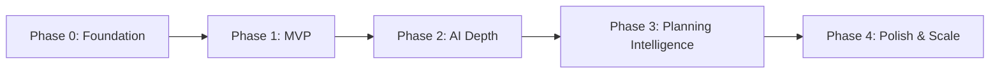

# Roadmap

## Document Information

| Field | Value |
| --- | --- |
| Document | Roadmap |
| Status | Draft |
| Version | 1.0.0 |
| Last Updated | 2026-07-16 |
| Owner | Product & Engineering |

## Table of Contents

- [Purpose](#purpose)
- [Roadmap Overview](#roadmap-overview)
- [Phases](#phases)
- [Milestones](#milestones)
- [Timeline](#timeline)
- [Notes](#notes)

## Purpose

This document sequences LifeOS's development beyond the MVP defined in [10-mvp.md](10-mvp.md), showing how the product grows from core functionality toward the full vision in [02-product-vision.md](02-product-vision.md).

## Roadmap Overview

## Phases

### Phase 0 — Foundation

- Repository, folder structure, and CI scaffolding per [13-folder-structure.md](13-folder-structure.md).
- Backend and mobile project scaffolding following [12-project-architecture.md](12-project-architecture.md).
- Docker-based local development environment (backend + PostgreSQL).

### Phase 1 — MVP

- All **Must**-priority functionality defined in [10-mvp.md](10-mvp.md) across all six modules.
- Baseline Swagger documentation for every endpoint.
- Baseline Material 3 implementation of the design system in [06-design-system.md](06-design-system.md).

### Phase 2 — AI Depth

- AI-generated trip itinerary suggestions (FR-TRAVEL-05).
- AI conversation history (FR-AI-03).
- Applying AI suggestions directly into Trip/Task records (FR-AI-04), completing the write-back flow described in [09-ai-features.md](09-ai-features.md).

### Phase 3 — Planning Intelligence

- Calendar view for tasks (FR-PLANNER-04) and task priority (FR-PLANNER-06).
- AI-assisted daily/weekly scheduling suggestions that consider both trips and tasks together, fulfilling the "intelligent scheduling" pillar of the vision statement.
- App preferences (FR-PROFILE-04) and session management (FR-PROFILE-05).

### Phase 4 — Polish & Scale

- Push notifications and deep-linking into specific trips, tasks, or AI conversations.
- Performance hardening against the targets in [08-non-functional-requirements.md](08-non-functional-requirements.md#performance).
- Expanded accessibility and localization coverage.

## Milestones

| Milestone | Phase | Definition of Done |
| --- | --- | --- |
| Dev Environment Ready | Phase 0 | A new engineer can run the backend, database, and mobile client locally following [16-development-guidelines.md](16-development-guidelines.md). |
| MVP Feature-Complete | Phase 1 | All Must-priority requirements in [07-functional-requirements.md](07-functional-requirements.md) implemented and documented in Swagger. |
| AI Write-Back Live | Phase 2 | Users can accept an AI suggestion and see it reflected as a real Trip or Task record. |
| Unified Scheduling Live | Phase 3 | The AI Assistant can produce scheduling suggestions spanning both Travel and Planner data. |
| Production Hardening Complete | Phase 4 | Non-functional targets in [08-non-functional-requirements.md](08-non-functional-requirements.md) are met and verified. |

## Timeline

Phases are sequenced by dependency, not fixed calendar dates: each phase builds on the module depth delivered in the previous one, and a phase does not begin until its predecessor's milestone is met. Calendar-specific target dates should be added to this section once Phase 0 is underway and a realistic velocity baseline exists.

## Notes

This roadmap reflects current product intent and will shift as the MVP surfaces real user feedback. Phase order should be revisited whenever [02-product-vision.md](02-product-vision.md) or [03-user-personas.md](03-user-personas.md) is revised.
