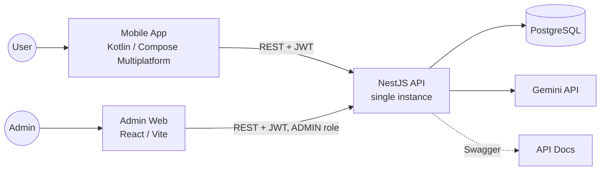
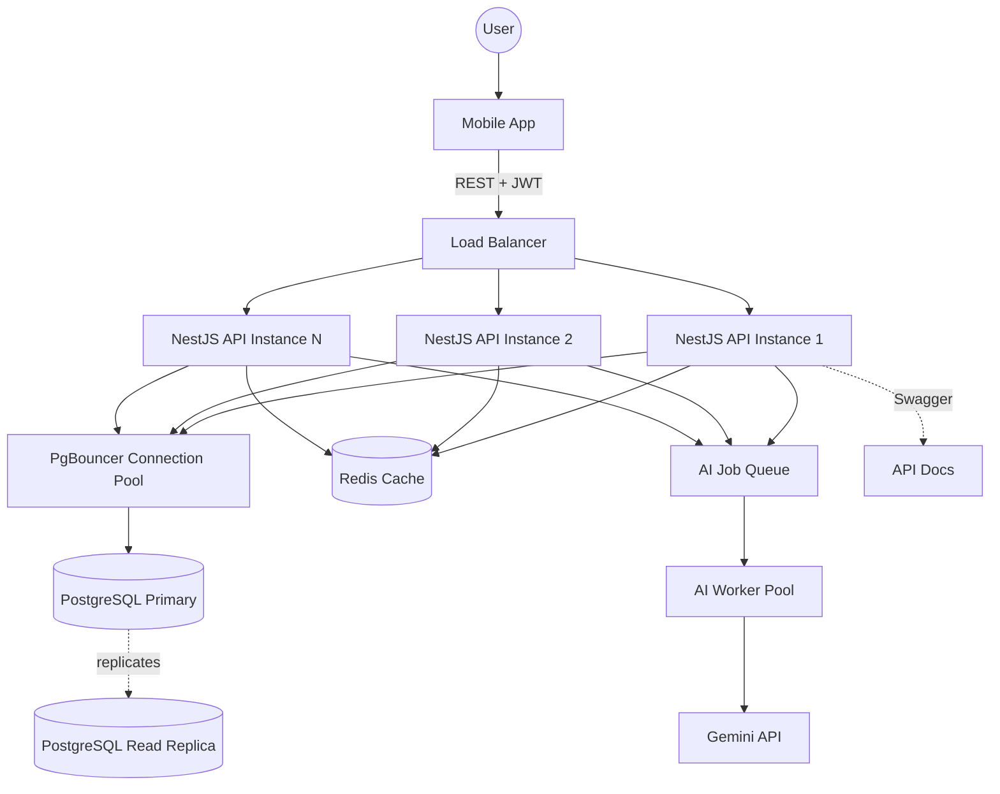
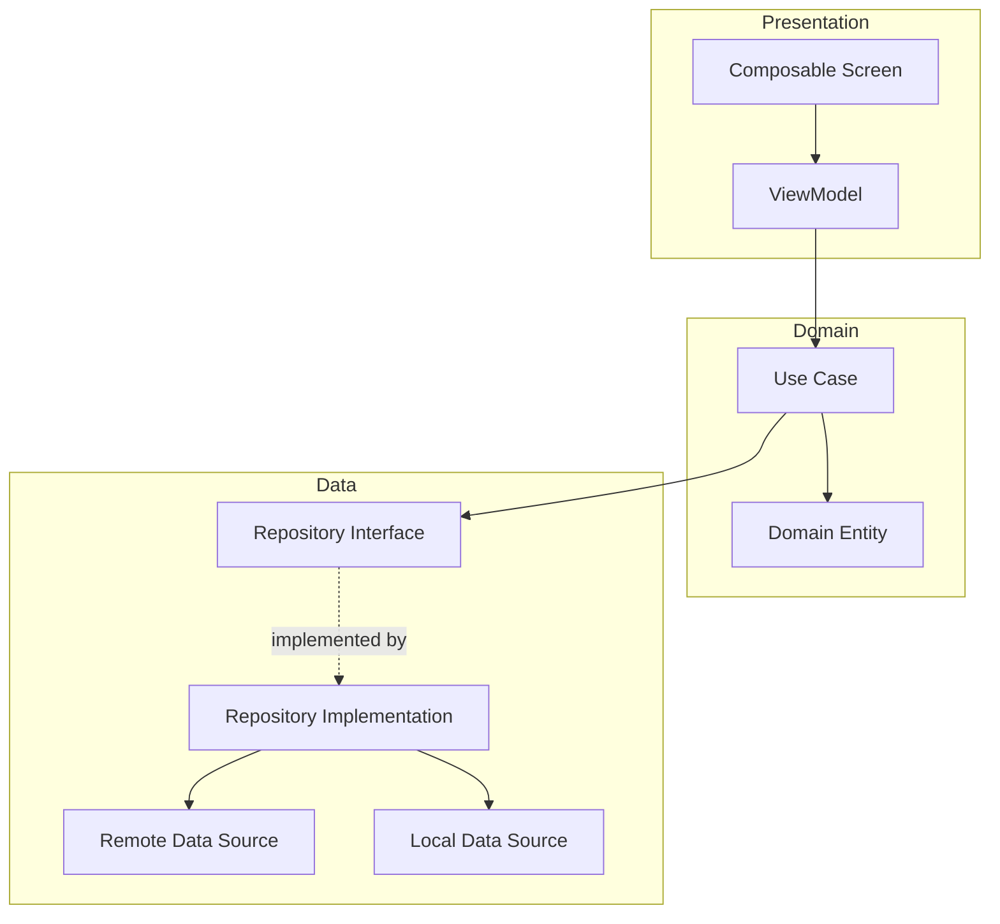
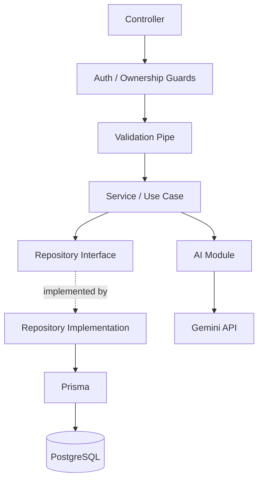
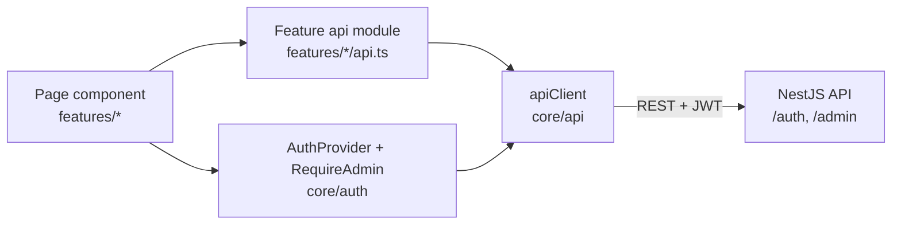
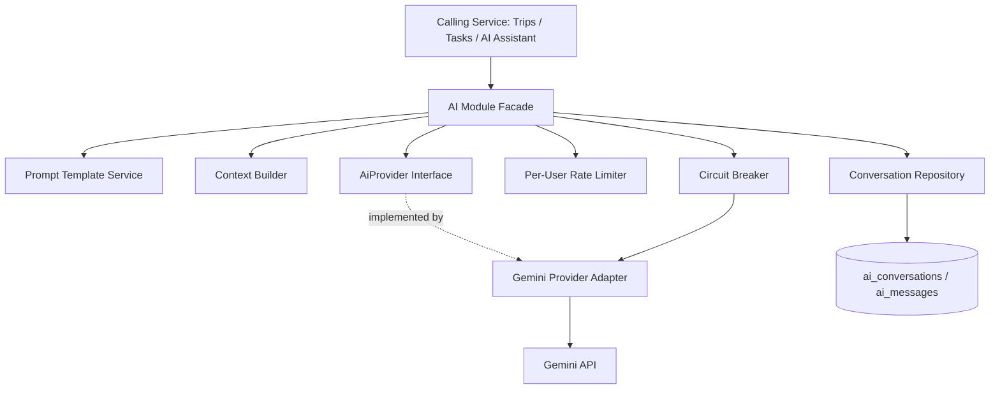

# Project Architecture

## Document Information

| Field | Value |
| --- | --- |
| Document | Project Architecture |
| Status | Draft |
| Version | 2.10.0 |
| Last Updated | 2026-10-05 |
| Owner | Engineering |

## Table of Contents

- [Purpose](#purpose)
- [Architecture Overview](#architecture-overview)
- [Mobile Architecture](#mobile-architecture)
- [Backend Architecture](#backend-architecture)
- [Admin Web Client](#admin-web-client)
- [System Components](#system-components)
- [Data Flow](#data-flow)
- [AI Integration Architecture](#ai-integration-architecture)
- [Security Architecture](#security-architecture)
- [Scalability & Production Readiness](#scalability--production-readiness)
- [Technology Stack](#technology-stack)
- [Integration Points](#integration-points)
- [Notes](#notes)

## Purpose

This document details how the architectural rules in [CLAUDE.md](../CLAUDE.md#architecture) — Clean Architecture, feature-first organization, MVVM, Repository Pattern, Dependency Injection, and SOLID — are applied concretely across the mobile client and backend, and defines the production-readiness posture required to serve a growing user base reliably. It is the technical companion to [13-folder-structure.md](13-folder-structure.md), which shows where this architecture lives on disk, [14-database-design.md](14-database-design.md), which defines the persistence layer, and [15-api-design.md](15-api-design.md), which defines the contract between mobile and backend.

## Architecture Overview

### MVP Deployment Topology

The MVP (see [10-mvp.md](10-mvp.md)) runs the simplest topology that satisfies the architecture rules — a single backend service, a single database, and Docker Compose for local and initial deployment, per [13-folder-structure.md](13-folder-structure.md#docker):

The Admin Web panel is a second, separate client of the same API (see [Admin Web Client](#admin-web-client)). It talks only to the `/auth/*` and `/admin/*` routes and has no connection to the database of its own.

This topology is intentionally simple: it satisfies Clean Architecture and the Repository Pattern internally, so it can scale outward (see [Scalability & Production Readiness](#scalability--production-readiness)) without an internal rewrite — scaling is an infrastructure change, not an architecture change.

### System Context (Target Production Topology)

As load grows toward the thousands-of-users range anticipated in [08-non-functional-requirements.md](08-non-functional-requirements.md#scalability), the same logical architecture is deployed behind additional infrastructure:

No mobile-facing contract changes as a result of this evolution — the mobile client always talks to "the API" through the same [15-api-design.md](15-api-design.md) contract regardless of how many instances sit behind the load balancer.

## Mobile Architecture

### Clean Architecture Layers

Each feature module (Authentication, Home Dashboard, AI Assistant, Travel, Planner, Profile) is internally structured in three layers, per [CLAUDE.md](../CLAUDE.md#architecture):

Dependencies point inward (Presentation → Domain ← Data); the domain layer has no dependency on Compose, networking, or persistence libraries. This is what allows each module to be unit-tested without a UI or network in the loop, per [16-development-guidelines.md](16-development-guidelines.md#testing-guidelines).

### Feature-First Module Organization

Modules do not share domain or data code with each other. Cross-module composition (e.g., Home Dashboard reading Travel and Planner data) happens by one feature's presentation layer depending on another feature's *public* domain layer (its use cases and read-only models), never on another feature's internal data layer. This keeps module boundaries enforceable at compile time and matches the physical layout in [13-folder-structure.md](13-folder-structure.md#mobile).

### MVVM Responsibilities

| Layer | Owns | Does Not Own |
| --- | --- | --- |
| Composable Screen | Rendering UI from an immutable UI state; forwarding user events to the ViewModel. | Business logic, direct data access, mutable state beyond local UI-only concerns (e.g., a text field's transient focus state). |
| ViewModel | Holding and exposing UI state (e.g., as `StateFlow<UiState>`); translating UI events into use case invocations; mapping domain results/errors into UI state. | Network or database calls; navigation decisions (it exposes one-off navigation *events*, the screen/navigator decides how to act on them). |
| Use Case (Domain) | A single unit of business logic (e.g., `CreateTripUseCase`, `SendAiMessageUseCase`); orchestrating one or more repositories. | Anything about how the result is displayed. |

State hoisting (per [06-design-system.md](06-design-system.md#design-principles)) means the ViewModel is the single source of truth for a screen's state; Composables never hold business state locally.

### Repository Pattern

- Each feature's domain layer defines repository **interfaces** (e.g., `TripRepository`) expressed purely in domain terms (domain entities, not network DTOs or database rows).
- The data layer provides the **implementation**, composing a remote data source (talking to [15-api-design.md](15-api-design.md) endpoints) and, where applicable, a local data source (on-device cache for offline read access).
- Use cases and ViewModels depend only on the interface; the concrete implementation is supplied via Dependency Injection, so it can be swapped (e.g., for a fake in tests) without touching domain or presentation code.

### Dependency Injection Boundaries

- Each feature module exposes a DI module that binds its repository interfaces to their implementations and provides its ViewModels — this is the feature's composition boundary.
- The application-level DI graph aggregates each feature's module; no feature module reaches into another feature's DI bindings directly.
- Cross-cutting dependencies (HTTP client, JWT token storage/refresh, app-wide navigation) are provided once at the app-level graph and injected into every feature that needs them, avoiding duplicate instances (e.g., two independent HTTP clients).

## Backend Architecture

### Layered Architecture

- **Controllers** — handle HTTP concerns (routing, request/response shape, Swagger annotations) and delegate immediately to services; no business logic lives in controllers, per [CLAUDE.md](../CLAUDE.md#backend-guidelines).
- **Guards** — enforce authentication (valid JWT) and authorization (resource ownership) before a request reaches a controller handler, per [15-api-design.md](15-api-design.md#authorization).
- **Pipes** — validate and transform incoming DTOs (reject malformed/unexpected fields) before business logic executes.
- **Services / Use Cases** — contain business logic per module (Auth, Users, Trips, Tasks, AI).
- **Repositories** — abstract PostgreSQL access behind interfaces, per the Repository Pattern; no service constructs a query directly against Prisma.
- **AI Module** — the sole integration point with the Gemini API, consumed by services rather than by controllers directly, detailed in [AI Integration Architecture](#ai-integration-architecture).

### Module Boundaries

Each NestJS feature module (`auth`, `users`, `trips`, `tasks`, `ai`, per [13-folder-structure.md](13-folder-structure.md#backend)) exposes only its controllers and a small public service surface to other modules; internal services and repository implementations are not exported from the module. A module that needs data from another module's domain (e.g., the AI module reading Trips and Tasks, per [09-ai-features.md](09-ai-features.md#data-requirements)) depends on that module's exported service interface, never on its repository or ORM entities directly.

### Repository Pattern (Backend)

- Repository interfaces are defined per module in the domain/service layer; implementations live alongside the Prisma-generated client they wrap.
- All repository methods that read user-owned data accept the requesting user's ID as a mandatory parameter and filter by it at the query level — ownership is enforced in the query, not only in a guard, as defense in depth.
- Soft-deleted rows (per [14-database-design.md](14-database-design.md#schema)) are excluded by default in every repository read method; a separate, explicitly-named method is required to include them (e.g., for an admin or restore flow), so soft-deleted data is never accidentally surfaced.

### Dependency Injection Boundaries (Backend)

- NestJS's built-in DI container wires each module's controllers, services, and repository implementations; repository interfaces are bound to concrete implementations via provider tokens, so implementations can be swapped (e.g., a test double) without changing consumers.
- The AI module's dependency on Gemini is bound behind an internal `AiProvider` interface (see [AI Integration Architecture](#ai-integration-architecture)); no other module is aware that Gemini specifically is the provider.

## Admin Web Client

The admin panel (`admin/`, see [13-folder-structure.md](13-folder-structure.md#admin)) is a browser single-page application for administrators. It is a separate client, not part of the mobile app, and it is read-only: it consumes the routes in [15-api-design.md](15-api-design.md#admin) and never writes data.

### Layers

The panel follows the same rules as the other two codebases — feature-first folders, dependencies pointing inward, no component talking to a data source directly:

- **Pages** hold presentation state only and never call `fetch`.
- **Feature API modules** are the panel's repositories: typed functions per endpoint.
- **`apiClient`** is the single place that knows URLs, headers, the `{ data }` / `{ data, meta }` envelope, error mapping and session renewal. It is created once and passed down, never constructed inside a component.

### Session Handling

The panel uses the backend's existing authentication as-is ([JWT Strategy](#jwt-strategy)); nothing was added to the backend for it.

- **Tokens live in memory only.** The access and refresh tokens are held in a closure and never written to `localStorage`, `sessionStorage`, cookies or IndexedDB, so no persisted copy exists for an injected script to read later. Reloading the page signs the admin out; that cost is accepted for an admin tool. The backend returns tokens in the JSON body and sets no cookie, so an `httpOnly` cookie session would be a backend change and is out of scope.
- **Single-flight renewal.** On a `401` the client calls `POST /auth/refresh` once and retries the original request once. Concurrent `401`s share that one refresh call: because refresh tokens rotate and a reused token revokes the whole session family, two parallel refreshes with the same token would sign the admin out.
- **`403` is final.** It is never retried or refreshed; the panel shows "access denied" and ends the session.

### Security Boundary

The backend is the only security boundary. `RolesGuard` reads the caller's current role from the database on every `/admin/*` request (see [15-api-design.md](15-api-design.md#roles)), so nothing the browser does can grant access. On the client:

- After login the panel calls `GET /admin/session` and follows its answer; the `role` in the login response is a display hint and is never trusted for access.
- The route guard (`RequireAdmin`) is navigation, not protection — bypassing it yields screens with no data.
- The panel can show only what the admin API returns: account fields and aggregate counts. Password hashes, tokens, profile free text and the content of tasks and trips are not in that contract.

### Deployment Status

The panel has not been deployed. Cross-origin access for it is controlled by the backend's `CORS_ALLOWED_ORIGINS` allow-list ([15-api-design.md](15-api-design.md#cors)), which is empty in production; hosting and that setting are covered in [17-deployment-guide.md](17-deployment-guide.md#8-admin-web-panel-not-deployed-yet).

## System Components

| Component | Responsibility |
| --- | --- |
| Mobile App | Kotlin / Compose Multiplatform client implementing all six modules' presentation and domain layers. |
| Admin Web | React / TypeScript single-page application for administrators; a read-only client of the `/admin/*` routes. See [Admin Web Client](#admin-web-client). |
| NestJS API | Backend serving REST endpoints, enforcing authentication, authorization, validation, and business logic. Stateless — horizontally scalable behind a load balancer. |
| PostgreSQL | System of record for users, trips, itinerary items, tasks, task lists, and AI conversations. |
| Connection Pool (PgBouncer) | Bounds the number of physical database connections as API instances scale out; see [Scalability & Production Readiness](#scalability--production-readiness). |
| Cache (Redis) | Optional read-through cache for hot, low-volatility reads (e.g., Home Dashboard aggregation); introduced when read load justifies it. |
| AI Job Queue | Decouples AI request submission from Gemini's response latency and rate limits; see [AI Integration Architecture](#ai-integration-architecture). |
| Gemini API | External AI provider consumed exclusively through the backend's AI module. |
| Docker | Containerizes the backend, database, and supporting infrastructure for local development and deployment, per [13-folder-structure.md](13-folder-structure.md#docker). |
| Swagger | Auto-generated, always-current API documentation served by the NestJS API. |

## Data Flow

1. The mobile client authenticates via the Authentication module and stores the issued JWT (see [15-api-design.md](15-api-design.md#authentication)).
2. Feature screens (Travel, Planner, Profile, Home Dashboard) call their ViewModel, which invokes a use case, which calls a repository, which performs an authenticated REST request to the NestJS API.
3. A guard validates the JWT and resource ownership; a pipe validates the request DTO; the corresponding service/use case executes and reads/writes PostgreSQL through the repository layer.
4. For AI-driven features, the relevant service calls the backend's AI module, which builds a prompt from a reusable template and the user's own trip/task context, then calls the Gemini API — synchronously for conversational replies, or via the AI Job Queue for longer-running generation (e.g., a full itinerary), per [AI Integration Architecture](#ai-integration-architecture).
5. Responses flow back through the same layers in reverse, with the domain layer (not the AI module) deciding what — if anything — gets persisted from an AI suggestion, per [09-ai-features.md](09-ai-features.md#limitations).

## AI Integration Architecture

This section defines the backend architecture referenced by [09-ai-features.md](09-ai-features.md) in enough technical depth to implement it. The overriding constraint is that **the AI provider must remain modular and replaceable** — nothing outside the AI module may depend on Gemini specifically.

**Implementation status (Sprint 18A, AI Foundation; Sprint 18B, First AI Capabilities; Sprint 18B.5, AI Platform Hardening; Sprint 19, Intelligent Planner; Sprint 20, Intelligent Travel; Sprint 21, Daily Brief Intelligence; Sprint 21.5, Architecture Review & Platform Stabilization; Sprint 22, Proactive Assistant Engine):** the `AiProvider` interface, two implementations (`GeminiProvider`, `OpenRouterProvider`), `ProviderRegistry`, a real routing layer (`ProviderRouter` — default/priority/feature-config/capability-preference selection, in that precedence order; still no cost/latency optimization), automatic multi-provider fallback (`AiFallbackExecutor`, gated by both `AI_FALLBACK_ENABLED` and each capability's own `fallbackAllowed`, walking `ProviderRouter.resolveChain`'s ordered candidates only after each one's own `AiRetryExecutor` retries are exhausted), the Context Builder, the Prompt Template Service (as `PromptBuilder` + `templates/`), and four capability-scoped HTTP endpoints owned by `AiModule` itself (`AiController`, under `/api/v1/ai/...` — `planner/analyze`, `planner/suggest`, `travel/suggest`, `daily-brief`) are implemented — see `backend/src/modules/ai/`, `backend/src/modules/README.md`, and [15-api-design.md](15-api-design.md#ai-capabilities). Each capability is fully self-describing metadata (preferred provider, fallback policy, generation parameters, a Zod-validated output schema) rather than hardcoded per-service behavior, and every AI response is schema-validated before it reaches a caller. Sprint 19 and Sprint 20 proved the platform's reusability by building further capabilities *owned by different modules* on the exact same engine, with zero duplication of `ProviderRegistry`/`ProviderRouter`/`AiFallbackExecutor`/`AiRetryExecutor`: `PlannerModule`'s `/api/v1/planner/ai/...` (natural-language task drafting, task breakdown, schedule analysis, priority suggestion, smart tags, deadline extraction; see [15-api-design.md](15-api-design.md#planner-ai-capabilities)) and `TravelModule`'s `/api/v1/travel/ai/...` (trip drafting, itinerary generation, budget analysis, packing suggestions, risk analysis, travel tags; see [15-api-design.md](15-api-design.md#travel-ai-capabilities)). Both `PlannerModule` and `TravelModule` are mutually circular with `AiModule` as a direct consequence (each needs `AiCapabilityService`; `AiModule` already needs each of their data services for `ContextBuilder`) — resolved with `forwardRef()` on every edge of both cycles, verified by actually booting the app each time, not by static analysis alone. Sprint 21 added the platform's first genuinely cross-module capability set: a brand-new `DailyBriefModule` (`/api/v1/daily-brief/...` — daily summary, schedule conflict detection, preparation suggestions, 7-day risk analysis, priority recommendations, motivation) that combines Planner and Travel context together via the existing `assistant` prompt template and the unmodified `ContextBuilder` — the first capabilities explicitly allowed to load both. Since none of its six capabilities operate on one specific existing entity (unlike Sprint 19/20's per-`Task`/`Trip` capabilities), `DailyBriefModule` only imports `AiModule` and introduces **no new circular dependency** — a one-directional consumer, the simplest of the three capability-owning modules built so far. Sprint 21.5 audited all of the above for duplication and dead code without changing any architecture or endpoint: promoted a shared Swagger error-response decorator and a shared `NaturalLanguageInputDto` (both previously redeclared per-module), reused the existing `DATE_PATTERN`/`TIME_PATTERN`/provider-id constants inside every capability's Zod schema instead of re-declaring them, removed `ProviderRouter`'s unused `resolve()` convenience method, and added direct unit coverage for `AiCapabilityService` and `classifyProviderHttpError` — see `backend/src/modules/README.md`'s Sprint 21.5 entry for the full list. Sprint 22 (Proactive Assistant Engine) added the platform's first genuinely *proactive* capability set — a brand-new `ProactiveAssistantModule` (`/api/v1/proactive-assistant/...` — suggestions, opportunity detection, reminder recommendations, smart insights, and prioritization) that analyzes the caller's Planner and Travel context unprompted rather than answering a specific question, built entirely on the same execution engine Sprint 19-21 already established (no AI platform component was modified). Its `prioritize` endpoint is deliberately **not** an AI capability — it is a deterministic rank/deduplicate/remove-contradictions algorithm over a caller-supplied suggestion list, avoiding a second AI call for well-defined data transformation work (see `backend/src/modules/proactive-assistant/prioritization/suggestion-prioritizer.util.ts`). Like `DailyBriefModule`, it imports only `AiModule` and introduces no circular dependency. The assistant remains suggestion-only across every route: nothing it returns is ever persisted, and it never creates a reminder or sends a notification. **Not yet implemented:** a generic chat/conversation endpoint (deliberately out of every AI sprint's scope so far — see [15-api-design.md](15-api-design.md#ai-assistant-not-yet-implemented)), `ConvoRepo`/`ai_conversations`/`ai_messages` (no persistence at all), the per-user Rate Limiter, the Circuit Breaker, and a third provider. The diagram and subsections below describe the full target design; treat anything not listed as "implemented" above as still aspirational.

### Prompt Management

- Prompt templates are versioned, named artifacts stored centrally in the AI module (e.g., `itinerary-suggestion.v1`, `daily-highlight.v1`), never inlined at call sites, per [CLAUDE.md](../CLAUDE.md#ai-integration-rules).
- Each template declares its required input variables explicitly; the Context Builder is responsible for supplying them, so a template can be unit-tested independently of any live user data.
- Template versioning allows a prompt to be improved without affecting in-flight conversations that reference the version they were built with.

### Context Management

- The Context Builder assembles only the data relevant to the specific request (e.g., a single trip's destination and dates, or the current day's tasks) — never the user's full history — per [09-ai-features.md](09-ai-features.md#data-requirements) and the data-minimization rule in [08-non-functional-requirements.md](08-non-functional-requirements.md#compliance).
- Context is fetched through the same repository interfaces used elsewhere (Trip Repository, Task Repository) — the AI module has no separate, privileged data access path.
- Sprint 17.0 (Users / Profile Backend) added `User.language`/`timezone`/`themePreference`/`notificationPreferences` specifically shaped for this: a future AI module can read them through `UsersRepository` the same way it reads Trip/Task data, to localize responses (`language`), format dates/times in the caller's own zone (`timezone`), and respect notification-related preferences — no schema change needed when that integration is built, per that sprint's explicit "Future AI Compatibility" requirement.
- A context size ceiling is enforced before a prompt is sent, so a user with an unusually large number of trips/tasks cannot produce an oversized or costly request; if content must be truncated, the most recent/relevant items are prioritized.

### Conversation Storage

Conversation and message persistence uses the `ai_conversations` and `ai_messages` tables defined in [14-database-design.md](14-database-design.md#data-model-overview). The AI module is the only writer to these tables; conversations are always scoped to the owning user.

### AI Service Boundaries

- The `AiProvider` interface exposes provider-agnostic operations (e.g., `generate(prompt, context) -> AiResult`); the `GeminiProvider` adapter is the only component that imports the Gemini SDK/client.
- Business decisions about AI output (e.g., turning a suggestion into a real `ItineraryItem` or `Task`) are made by the calling feature's use case, not by the AI module — the AI module returns structured suggestions, it never writes to another module's tables directly.
- Replacing or supplementing Gemini with another provider requires only a new `AiProvider` implementation; the facade, prompt templates (adapted per provider's input format if needed), rate limiter, and circuit breaker are unaffected.

### Error Handling

| Failure | Handling |
| --- | --- |
| Gemini timeout | Treated as a recoverable error; surfaced to the client as a structured error (see [15-api-design.md](15-api-design.md#error-handling)) with a retry hint. |
| Gemini 4xx (invalid request) | Logged as an internal defect (a template/context bug), not retried, and surfaced as a generic assistant error to the user. |
| Gemini 5xx / provider outage | Circuit breaker opens after a failure threshold; subsequent requests fail fast with a clear "assistant unavailable" response instead of queuing up timeouts, per [08-non-functional-requirements.md](08-non-functional-requirements.md#reliability). |
| Rate limit exceeded (provider-side or per-user) | Request is rejected immediately with a `429`-equivalent response instructing the client to slow down; not silently retried in a way that could compound the limit. |

### Rate Limiting

- A per-user rate limiter (token-bucket, backed by an in-memory or Redis-backed store as scale requires) caps how many AI requests a single user can issue per minute, protecting both the Gemini quota and overall backend capacity.
- Limits are enforced at the AI module facade, so every entry point into AI (dedicated Assistant, Travel suggestions, Planner suggestions) shares the same budget per user rather than each feature having an independent, bypassable limit.

### Retry Strategy

- Transient failures (timeouts, 5xx) are retried a small, bounded number of times with exponential backoff and jitter.
- Retries are only applied to idempotent AI read/generate operations; once a suggestion has been accepted and a write is in progress (per [09-ai-features.md](09-ai-features.md#feature-overview)), that write follows normal database transaction semantics, not the AI retry policy.
- The circuit breaker takes precedence over retries: once open, requests fail immediately rather than retrying into a known-down dependency.

## Security Architecture

This section defines the concrete mechanisms implementing the security requirements in [08-non-functional-requirements.md](08-non-functional-requirements.md#security) and [CLAUDE.md](../CLAUDE.md#backend-guidelines).

### JWT Strategy

- Access tokens are short-lived (target: 15 minutes) and signed with an asymmetric algorithm (RS256), so the public key used to verify tokens can be distributed to any service instance without exposing the private signing key — important once the API scales to multiple instances.
- Refresh tokens are longer-lived (target: 30 days), opaque to the client, and stored server-side only as a salted hash (`refresh_tokens.token_hash`, per [14-database-design.md](14-database-design.md#entities)) — the raw refresh token is never persisted.
- **Refresh token rotation:** every use of a refresh token issues a new refresh token and immediately revokes the one just used. If a revoked refresh token is presented again (a sign of theft/replay), the entire token family for that session is revoked and the user is required to re-authenticate.

### Password Hashing

Passwords are hashed with bcrypt (configurable cost factor, `BCRYPT_SALT_ROUNDS`, default 12), implemented in Sprint 14.0 (Authentication Backend). An earlier draft of this document specified Argon2id — memory-hard and the more current industry recommendation over bcrypt for greenfield systems — but Sprint 14.0's brief explicitly specified bcrypt, and bcrypt remains a secure, extremely widely deployed choice with more mature, battle-tested Node.js tooling (notably avoiding another native-binary/Alpine-musl compatibility risk on top of the one already worked through for Prisma's engine in Sprint 13.0). Revisiting this in favor of Argon2id remains an option for a future sprint if desired, but is not planned work.

Refresh tokens are hashed differently: SHA-256, not bcrypt. A raw refresh token is already a high-entropy, server-generated random secret (unlike a human-chosen password), so it doesn't need a slow, memory-hard hash for brute-force resistance — and unlike passwords, refresh tokens must be looked up by exact match on every use, which bcrypt cannot do (each hash of the same input differs). SHA-256 is deterministic, directly indexable, and the standard choice for this specific case; see `refresh_tokens.token_hash`'s doc comment in `prisma/schema.prisma`.

### API Validation & Input Sanitization

- Every request DTO is validated by a global validation pipe before it reaches a controller handler; unknown fields are rejected rather than silently ignored, preventing mass-assignment-style bugs.
- All database access goes through Prisma using parameterized queries exclusively — no string-concatenated SQL, eliminating SQL injection as an attack surface.
- User-supplied free text (task/trip titles, descriptions, AI messages) is treated as data, never as executable content; the mobile client is responsible for safe rendering (no raw HTML rendering of user or AI content).

### Secrets Management

- Secrets (database credentials, JWT signing keys, Gemini API key) are never committed to the repository; they are injected via environment variables at container runtime, per [13-folder-structure.md](13-folder-structure.md#docker).
- Local development uses a `.env` file excluded from version control; deployed environments source secrets from the hosting platform's secret storage.
- The JWT signing key pair is rotatable independently of application deployment, so a compromised key can be revoked without a full redeploy.

## Scalability & Production Readiness

This section documents how the architecture evolves to serve a growing user base, mapped to the phases already defined in [11-roadmap.md](11-roadmap.md), so scaling work is planned rather than reactive.

| Concern | MVP (Phase 1) | Scale-Out (Phase 4 — Polish & Scale) | Reasoning |
| --- | --- | --- | --- |
| API instances | Single container | N stateless containers behind a load balancer | The API holds no session state (JWT is self-contained), so horizontal scaling requires no architectural change, only more instances. |
| Database connections | Direct Prisma connections | PgBouncer connection pooling | Postgres has a hard connection ceiling; pooling lets many API instances share a bounded set of physical connections. |
| Reads | Direct queries | Optional read replica for reporting/heavy read paths; Redis cache for hot, low-volatility reads (e.g., dashboard aggregation) | Avoids over-engineering at MVP scale while keeping a documented path once read volume justifies it. |
| AI requests | Synchronous call to Gemini per request | Job queue + worker pool for longer-running AI generation, with the per-user rate limiter and circuit breaker from [AI Integration Architecture](#ai-integration-architecture) applied from day one | Gemini's own latency and rate limits are a bottleneck independent of user count, so the queueing pattern is worth introducing early, even while API instance count stays at one. |
| Observability | Structured application logs | Centralized log aggregation, request tracing correlated by request ID, health-check endpoints per instance | Required once more than one instance is running, so failures can be attributed to a specific instance/request. |

Introducing the Phase 4 items before they are needed would violate the "do not over-engineer" principle in [CLAUDE.md](../CLAUDE.md#general-development-principles); the MVP topology remains deliberately simple, with this table serving as the pre-agreed plan for when to introduce each piece.

## Technology Stack

Architecturally, each technology in [CLAUDE.md](../CLAUDE.md#tech-stack) maps to a specific role:

| Technology | Architectural Role |
| --- | --- |
| Kotlin | Language for the entire mobile client, shared across platform targets. |
| Compose Multiplatform | Presentation layer rendering for the mobile client. |
| Material 3 | Component and theming system underlying the presentation layer, per [06-design-system.md](06-design-system.md). |
| Koin | Dependency Injection container for the mobile client, wiring the DI boundaries described above. |
| Kotlinx Serialization | JSON (de)serialization for both the Ktor client and any locally cached DTOs. |
| Ktor Client | The shared `HttpClient` every feature's remote data source depends on, per [Repository Pattern](#repository-pattern). |
| Coil | Image loading (trip cover images, user avatars) for Compose Multiplatform. |
| Navigation (Compose Multiplatform Navigation) | Backs `LifeOSNavHost`; each feature registers its screens' routes into the shared graph. |
| React | Presentation layer of the admin web panel. |
| TypeScript | Language of the admin web panel (and of the backend). |
| Vite | Development server and production bundler for the admin web panel. |
| React Router | Client-side routing for the admin web panel; one route table behind a single admin guard. |
| Vitest | Test runner for the admin web panel, with Testing Library. |
| NestJS | Backend application framework providing the module/controller/service/DI structure. |
| Prisma | ORM and migration tool for PostgreSQL, wrapped by repository implementations per [Repository Pattern (Backend)](#repository-pattern-backend). |
| PostgreSQL | Persistence layer accessed exclusively through the repository layer. |
| Docker | Runtime packaging for the backend, database, and supporting infrastructure, ensuring parity between local and deployed environments. |
| JWT | Stateless authentication mechanism between mobile client and backend, enabling horizontal scaling with no shared session store. |
| Swagger | Contract and documentation layer generated directly from the backend's controllers and DTOs. |
| Gemini API | External AI provider, isolated behind the backend's `AiProvider` abstraction. |

## Integration Points

| Integration | Direction | Notes |
| --- | --- | --- |
| Mobile ↔ NestJS API | Bidirectional, REST over HTTPS | JWT bearer token on every authenticated request. |
| Admin Web ↔ NestJS API | Bidirectional, REST over HTTPS | JWT bearer token; only `/auth/*` and `/admin/*` routes; the `ADMIN` role is checked by the backend on every request. Cross-origin, so the panel's origin must be in `CORS_ALLOWED_ORIGINS`. |
| NestJS API ↔ PostgreSQL | Bidirectional | Accessed only through repository implementations, via a connection pool at scale. |
| NestJS API ↔ Gemini API | Outbound | Isolated to the AI module's `AiProvider` abstraction; no other module calls Gemini directly. |
| NestJS API ↔ Swagger | Generated | Documentation is generated from controller/DTO annotations, not maintained by hand. |
| `TravelModule` ↔ `PlannerModule` | Outbound (Travel calls Planner) | Sprint 16.0: `TravelModule` imports `PlannerModule` and `ItineraryService` injects `PlannerService` directly (exported for exactly this) — the same cross-module-service-injection pattern `AuthModule` established with `UsersModule`. Never repository-to-repository, and never a duplicate task model: an itinerary item optionally links to a real Planner `Task` (`source = TRAVEL`) via `ItineraryItem.taskId`, created/updated/deleted through `PlannerService`'s own methods. This is the template for any future module (e.g. AI) that needs to create Planner tasks. |

## Notes

This document defines architectural structure and rules. Concrete folder-level organization implementing this structure is defined in [13-folder-structure.md](13-folder-structure.md); do not duplicate folder trees here. Infrastructure introduced under [Scalability & Production Readiness](#scalability--production-readiness) (connection pooling, caching, job queue) should be reflected in [13-folder-structure.md](13-folder-structure.md#docker) once adopted.
