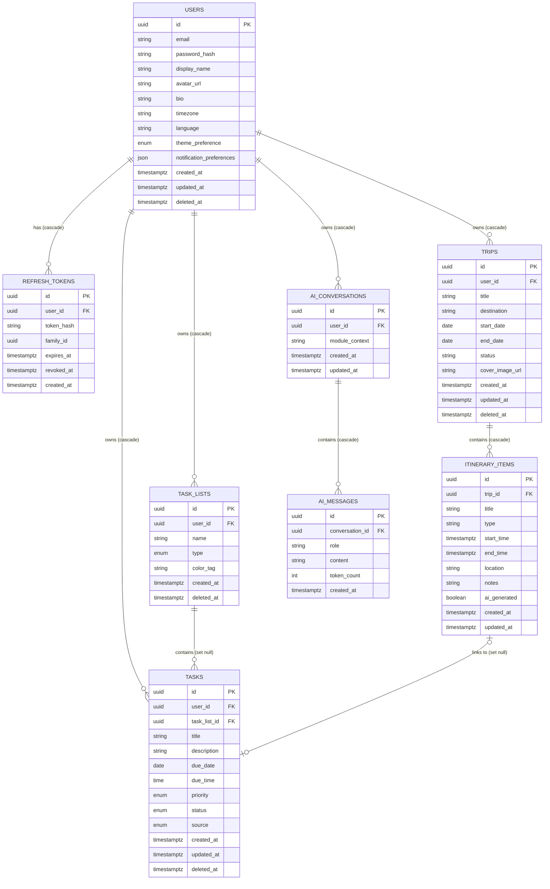

# Database Design

## Document Information

| Field | Value |
| --- | --- |
| Document | Database Design |
| Status | Draft |
| Version | 2.0.0 |
| Last Updated | 2026-07-16 |
| Owner | Engineering |

## Table of Contents

- [Purpose](#purpose)
- [Data Model Overview](#data-model-overview)
- [Entities](#entities)
- [Relationships](#relationships)
- [Foreign Keys and Cascade Rules](#foreign-keys-and-cascade-rules)
- [Schema](#schema)
- [Key Design Decisions](#key-design-decisions)
- [Indexing Strategy](#indexing-strategy)
- [Notes](#notes)

## Purpose

This document defines the PostgreSQL data model backing LifeOS, implementing the database conventions in [CLAUDE.md](../CLAUDE.md#database-guidelines) and supporting the functional requirements in [07-functional-requirements.md](07-functional-requirements.md). It is the source of truth referenced by [15-api-design.md](15-api-design.md) for request/response shapes and by [12-project-architecture.md](12-project-architecture.md) for how the persistence layer is accessed.

## Data Model Overview

The data model is organized around the five modules: `users` and `refresh_tokens` (Authentication/Profile), `trips` and `itinerary_items` (Travel), `task_lists` and `tasks` (Planner), and `ai_conversations`/`ai_messages` (AI Assistant). Home Dashboard has no dedicated tables — it reads from Trips and Tasks. Profile's preferences (theme, language, timezone, notification preferences) are NOT a separate `user_preferences` table as originally planned here — Sprint 17.0 (Users / Profile Backend) added them directly as columns on `users` instead, per that sprint's explicit "extend the existing User model only if required... Do NOT introduce unnecessary tables" scope. `users.notification_preferences` is `Json`, not fixed boolean columns, so new preference keys don't need a schema migration — see `User`'s doc comment in `prisma/schema.prisma`.

## Entities

| Entity | Module | Soft Delete? | Notes |
| --- | --- | --- | --- |
| `users` | Authentication / Profile | Yes | Core account record; see FR-AUTH-01, FR-PROFILE-01. Sprint 17.0 added `bio`/`timezone`/`language`/`theme_preference`/`notification_preferences` directly here — no separate `user_preferences` table (see [Data Model Overview](#data-model-overview)). `role` (`UserRole` enum: `USER`/`ADMIN`, `NOT NULL DEFAULT 'USER'`) drives role-based authorization, per [15-api-design.md](15-api-design.md#roles); it is changed only by the `admin:promote` command-line tool, never through the API. |
| `refresh_tokens` | Authentication | No (revoked, not deleted) | Revocation is tracked via `revoked_at` rather than deletion, preserving audit history (FR-AUTH-06, FR-PROFILE-05). Grouped by `family_id` to support rotation-reuse detection; see [Key Design Decisions](#key-design-decisions). |
| `trips` | Travel | Yes | Soft delete per FR-TRAVEL-06. Sprint 16.0 split the original single `destination` column into `destination` (city) + `country`, per that sprint's explicit `TRIP MODEL`. |
| `itinerary_items` | Travel | No (cascades with trip) | Child of `trips`; hard-deleted automatically when the parent trip is hard-purged. Not exposed independently of a trip. Sprint 16.0 replaced the original single `start_time`/`end_time` timestamptz pair with `date` + optional `start_time`/`end_time` (time-only) — matching the same "domain owns real dates, presentation formats them" split Sprint 15.0 applied to `tasks.due_date`/`due_time` — and added `order_index`, `type`/`transportation_type`/`accommodation_type`, and a nullable, unique `task_id` linking to the Planner task the item spawned, if any (see [12-project-architecture.md](12-project-architecture.md#integration-points)). |
| `task_lists` | Planner | Yes | Deleting a list does not delete its tasks; see [Relationships](#relationships). |
| `tasks` | Planner | Yes | Soft delete keeps completed/removed tasks available for the AI Assistant's context and for undo (FR-PLANNER-05). |
| `ai_conversations` | AI Assistant | No | Retained for AI Conversation History (FR-AI-03). |
| `ai_messages` | AI Assistant | No | Child of `ai_conversations`. Carries `token_count` for AI usage/cost observability, per [12-project-architecture.md](12-project-architecture.md#rate-limiting). |

## Relationships

- A `user` has many `trips`, `task_lists`, `tasks`, `refresh_tokens`, and `ai_conversations`.
- A `trip` has many `itinerary_items`; soft-deleting a trip does not delete its itinerary items, so a restored trip retains its itinerary.
- A `task_list` has many `tasks`. `tasks.task_list_id` is nullable — a task may exist without belonging to any list (FR-PLANNER-01), and deleting a list detaches rather than deletes its tasks.
- An `ai_conversation` has many `ai_messages`, ordered by `created_at`.
- All ownership foreign keys (`user_id`) enforce that a user can only ever access their own records, per [08-non-functional-requirements.md](08-non-functional-requirements.md#security) and the repository-level ownership filtering defined in [12-project-architecture.md](12-project-architecture.md#repository-pattern-backend).

## Foreign Keys and Cascade Rules

Every foreign key has an explicit `ON DELETE` behavior — none are left to the database default (`NO ACTION`), so deletion behavior is a deliberate decision rather than an accident of whichever row happens to be removed first.

| Foreign Key | References | On Delete | Reasoning |
| --- | --- | --- | --- |
| `refresh_tokens.user_id` | `users.id` | `CASCADE` | A user's sessions have no meaning once the user record is gone (hard delete only occurs for account erasure, not routine soft delete). |
| `trips.user_id` | `users.id` | `CASCADE` | Trips are exclusively owned; no sharing model exists (per [07-functional-requirements.md](07-functional-requirements.md#assumptions)). |
| `task_lists.user_id` | `users.id` | `CASCADE` | Same ownership model as trips. |
| `tasks.user_id` | `users.id` | `CASCADE` | Same ownership model as trips. |
| `ai_conversations.user_id` | `users.id` | `CASCADE` | Conversations have no meaning detached from their owning user. |
| `itinerary_items.trip_id` | `trips.id` | `CASCADE` | Itinerary items are never accessed independently of a trip (per [05-screen-inventory.md](05-screen-inventory.md#travel)); a hard-purged trip should not leave orphaned items. |
| `tasks.task_list_id` | `task_lists.id` | `SET NULL` | A task is a first-class record independent of its list (FR-PLANNER-01); deleting a list must not destroy its tasks. |
| `itinerary_items.task_id` | `tasks.id` | `SET NULL` | Sprint 16.0's Planner integration link. `ItineraryItem` is the first-class record; if its linked `Task` is ever hard-deleted independently (not the normal path — Planner only soft-deletes), the item just loses its link rather than being destroyed. |
| `ai_messages.conversation_id` | `ai_conversations.id` | `CASCADE` | Messages have no meaning outside their conversation. |

`CASCADE` here applies to **hard deletes only**. Routine user-facing deletion of `users`, `trips`, `task_lists`, and `tasks` is a soft delete (`deleted_at` set), which does not trigger any `ON DELETE` behavior at all — cascades only activate for genuine row removal (e.g., a GDPR-style erasure job or scheduled purge of long-soft-deleted records).

## Schema

- All primary keys are `UUID`; see [Key Design Decisions](#key-design-decisions) for the generation strategy.
- All timestamp columns use `TIMESTAMPTZ` (timestamp with time zone), not naive `TIMESTAMP`, so stored instants are unambiguous regardless of the database server's or a future read replica's local timezone configuration.
- All tables include `created_at`; tables that are ever updated in place also include `updated_at`.
- Soft-deletable tables (`users`, `trips`, `task_lists`, `tasks`) include a nullable `deleted_at`; a `NULL` value means the record is active. Queries against these tables must filter `deleted_at IS NULL` by default at the repository layer, per [12-project-architecture.md](12-project-architecture.md#repository-pattern-backend).
- `trips.status` is constrained via a `CHECK` constraint to `planned`, `ongoing`, `completed`, or `cancelled`.
- `tasks.status`, `tasks.priority`, and `tasks.source` are Postgres native enums (`TaskStatus`: `TODO`/`IN_PROGRESS`/`DONE`; `TaskPriority`: `LOW`/`MEDIUM`/`HIGH`; `TaskSource`: `PLANNER`/`HOME`/`TRAVEL`/`AI_ASSISTANT`), not string `CHECK` constraints as originally drafted here — Sprint 15.0 (Planner Backend) implemented them as uppercase enums to match the mobile client's Kotlin enum tokens exactly (`com.lifeos.app.features.planner.domain.model.TaskStatus`/`TaskPriority`/`TaskSource`), per that sprint's "must match the mobile Planner architecture" requirement (FR-PLANNER-06).
- `tasks.due_date`/`tasks.due_time` are two columns (`date` and nullable `time`, not a single `timestamptz`) — matching mobile's `TaskDueDate(date: LocalDate, time: LocalTime?)` exactly. `due_date` is required; `due_time` is nullable for all-day tasks.
- `ai_messages.role` is constrained to `user` or `assistant`.
- `users.email` has a `UNIQUE` constraint (case-insensitive, via a unique index on `lower(email)`) in addition to the lookup index below, so uniqueness is enforced at the database level, not only in application code.

## Key Design Decisions

### UUID Strategy

Primary keys are UUIDs rather than sequential integers, per [CLAUDE.md](../CLAUDE.md#database-guidelines), for two production-relevant reasons: they can be generated client-side or application-side before an insert (useful for the mobile client's offline-created records and for the AI module composing related rows in one transaction), and they avoid leaking record counts/creation order through predictable IDs in API responses.

Random (v4) UUIDs cause B-tree index fragmentation as a table grows, because each insert lands at a random point in the primary key index rather than appending at the end. At the scale anticipated in [08-non-functional-requirements.md](08-non-functional-requirements.md#scalability), this is addressed by generating primary keys as **time-ordered UUIDs (UUIDv7)** wherever the generating layer supports it, falling back to standard v4 (`gen_random_uuid()`) only where v7 generation isn't yet available. UUIDv7 keeps the ordering/index-locality benefits of a sequential key while remaining a UUID at the API boundary — no change to the API contract in [15-api-design.md](15-api-design.md) is required if this is introduced later.

### Soft Delete Strategy

Soft delete (`deleted_at`) is used only where a user-facing undo or historical reference has value: `users`, `trips`, `task_lists`, `tasks`. It is deliberately **not** used for `itinerary_items` or `ai_messages`, which are only ever meaningful in the context of their parent and are cleaned up via cascade instead — adding soft delete there would add query complexity (every join would need an extra filter) without a corresponding product requirement. Active-row queries on soft-deletable tables use a **partial index** (`WHERE deleted_at IS NULL`) rather than a plain index, so the common case (active records) stays small and fast as soft-deleted history accumulates.

### Timestamp Strategy

`created_at` is set once at insert (database default `now()`); `updated_at` is maintained by the application/ORM layer on every write rather than a database trigger, keeping the "what changed and why" logic in the same layer as the business logic that made the change. All timestamps are stored and transmitted in UTC (`TIMESTAMPTZ`, ISO 8601 over the API per [15-api-design.md](15-api-design.md#request-and-response-formats)); any local-timezone display is a mobile-client presentation concern, not a backend one.

### Refresh Token Family Tracking

`refresh_tokens.family_id` groups all tokens descended from a single login through subsequent rotations (per [12-project-architecture.md](12-project-architecture.md#jwt-strategy)). If a token is presented after it has already been rotated away, every token sharing its `family_id` is revoked, since reuse of a rotated-out token is a signal of token theft, not a legitimate client.

## Indexing Strategy

| Table | Index | Reason |
| --- | --- | --- |
| `users` | Unique index on `lower(email)` | Enforce one account per email case-insensitively; supports sign-in lookup (FR-AUTH-02). |
| `users` | Partial index on `id` `WHERE deleted_at IS NULL` | Keeps active-account lookups fast independent of retained soft-deleted accounts. |
| `refresh_tokens` | Index on `user_id`; index on `token_hash`; index on `family_id`; index on `expires_at` | Fast session validation, revocation, and family-wide revocation; `expires_at` index supports a periodic cleanup job for expired tokens. |
| `trips` | Partial index on `(user_id, start_date)` `WHERE deleted_at IS NULL` | Supports "My Trips" listing grouped/sorted by date (FR-TRAVEL-02) without scanning soft-deleted rows. |
| `itinerary_items` | Index on `trip_id` | Supports loading a trip's itinerary (Trip Details screen). |
| `task_lists` | Partial index on `user_id` `WHERE deleted_at IS NULL` | Supports listing a user's active task lists (FR-PLANNER-02). |
| `tasks` | Partial index on `(user_id, due_date)` `WHERE deleted_at IS NULL`; index on `task_list_id` | Supports Task List, Calendar View, and Home Dashboard "today's tasks" queries (FR-HOME-01, FR-PLANNER-04). |
| `ai_conversations` | Index on `user_id` | Supports AI Conversation History (FR-AI-03). |
| `ai_messages` | Index on `(conversation_id, created_at)` | Supports ordered, paginated message retrieval within a conversation, per [15-api-design.md](15-api-design.md#pagination). |

## Notes

Schema changes must be introduced via migrations, never by editing existing migration files, so that every environment (including Docker-based local setups per [13-folder-structure.md](13-folder-structure.md#docker)) can reach the same schema state deterministically. Any change to cascade behavior in the [Foreign Keys and Cascade Rules](#foreign-keys-and-cascade-rules) table is a data-safety-relevant change and must be called out explicitly in the pull request per [16-development-guidelines.md](16-development-guidelines.md#code-review-process).
