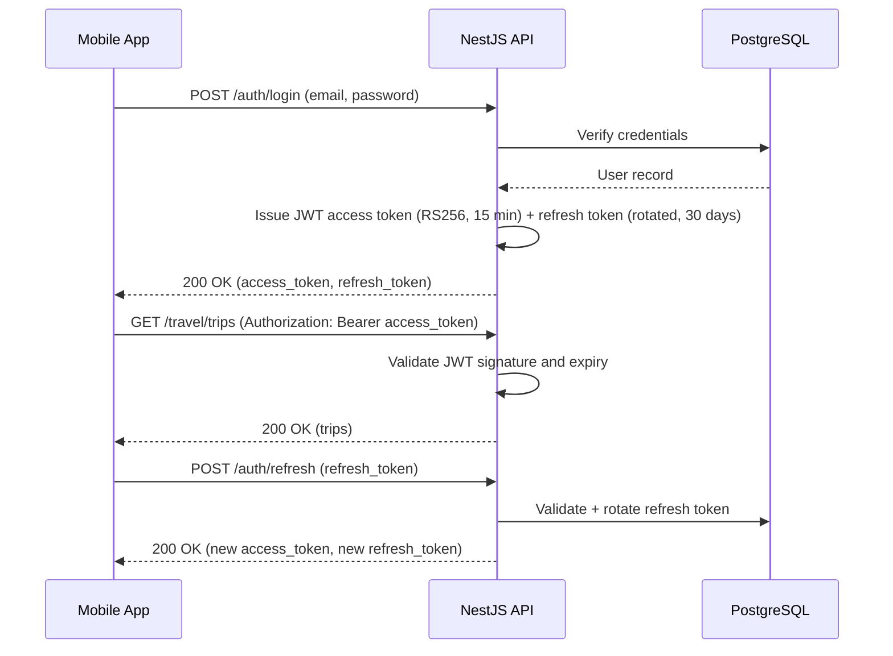

# API Design

## Document Information

| Field | Value |
| --- | --- |
| Document | API Design |
| Status | Draft |
| Version | 2.6.0 |
| Last Updated | 2026-07-22 |
| Owner | Engineering |

## Table of Contents

- [Purpose](#purpose)
- [API Overview](#api-overview)
- [Endpoints](#endpoints)
- [Request and Response Formats](#request-and-response-formats)
- [Authentication](#authentication)
- [Authorization](#authorization)
- [Pagination](#pagination)
- [Filtering and Sorting](#filtering-and-sorting)
- [Rate Limiting](#rate-limiting)
- [CORS](#cors)
- [Error Handling](#error-handling)
- [Versioning](#versioning)
- [Notes](#notes)

## Purpose

This document defines the REST API surface exposed by the NestJS backend, implementing the entities in [14-database-design.md](14-database-design.md) and satisfying the functional requirements in [07-functional-requirements.md](07-functional-requirements.md), per the backend conventions in [CLAUDE.md](../CLAUDE.md#backend-guidelines) and the layered request pipeline (guards → pipes → services) defined in [12-project-architecture.md](12-project-architecture.md#layered-architecture).

## API Overview

- The API is a versioned REST API (`/api/v1`), organized by resource, matching the backend module structure in [13-folder-structure.md](13-folder-structure.md#backend).
- All endpoints except authentication endpoints require a valid JWT bearer token.
- Every endpoint is documented in Swagger, served at `/api/docs`, generated from controller and DTO annotations rather than maintained separately.
- The API is stateless: no server-side session is required beyond what the JWT and refresh token carry, per [12-project-architecture.md](12-project-architecture.md#scalability--production-readiness), so any endpoint can be served by any API instance.

## Endpoints

### Authentication

| Method | Path | Requirement | Auth Required |
| --- | --- | --- | --- |
| POST | `/api/v1/auth/register` | FR-AUTH-01 | No |
| POST | `/api/v1/auth/login` | FR-AUTH-02, FR-AUTH-03 | No |
| POST | `/api/v1/auth/refresh` | FR-AUTH-03 | No (refresh token) |
| POST | `/api/v1/auth/logout` | FR-AUTH-05 | Yes |
| POST | `/api/v1/auth/forgot-password` | FR-AUTH-04 | No |
| POST | `/api/v1/auth/reset-password` | FR-AUTH-04 | No |

### Users / Profile

`GET`/`PATCH /users/me` were already correctly specified below (Sprint 17.0 (Users / Profile Backend) implemented them exactly as drafted). One deviation: preferences live at top-level `/users/preferences`, not nested `/users/me/preferences` as originally drafted — that sprint's brief was explicit, so this table was updated to match (same precedent as Planner's `/planner/...` and Travel's `/travel/...` prefixes). No separate `GET /users/preferences` — `GET /users/me` already returns every preference field in the same payload.

| Method | Path | Requirement | Auth Required |
| --- | --- | --- | --- |
| GET | `/api/v1/users/me` | FR-PROFILE-01 | Yes |
| PATCH | `/api/v1/users/me` | FR-PROFILE-02 | Yes |
| PATCH | `/api/v1/users/preferences` | FR-PROFILE-04 | Yes |
| PATCH | `/api/v1/users/me/password` | FR-PROFILE-03 | Yes |
| GET | `/api/v1/users/me/sessions` | FR-PROFILE-05 | Yes |
| DELETE | `/api/v1/users/me/sessions/:id` | FR-PROFILE-05 | Yes |

`PATCH /users/me/password` (FR-PROFILE-03) and the session-management pair (FR-PROFILE-05) remain undelivered — Sprint 17.0's explicit scope was "Do NOT implement: Password reset" and its 3-route API list had no session routes. See `backend/src/modules/README.md` for the suggested next step.

### Admin

Role-restricted routes for the admin panel, implemented by `AdminModule` and consumed by the web client in `admin/` (see [12-project-architecture.md](12-project-architecture.md#admin-web-client)). Every route requires an authenticated account whose **current role in the database** is `ADMIN` (see [Authorization](#authorization)): a missing or invalid token returns `401`, a regular user `403`.

| Method | Path | Requirement | Auth Required |
| --- | --- | --- | --- |
| GET | `/api/v1/admin/session` | Admin panel session check | Yes (`ADMIN`) |
| GET | `/api/v1/admin/dashboard` | System-wide aggregate counts | Yes (`ADMIN`) |
| GET | `/api/v1/admin/users` | Paginated user list (search, filter, sort) | Yes (`ADMIN`) |
| GET | `/api/v1/admin/users/:id` | One user's account summary and aggregate counts | Yes (`ADMIN`) |

All admin routes are **read-only**: there is no admin route that creates, changes or deletes anything. Roles still change only through the `admin:promote` command-line tool (see [Roles](#roles)).

`GET /admin/session` returns the calling admin's own `id`, `email`, `displayName` and `role`. It reads no other user's data; the admin panel calls it after login to confirm, against the backend, that the account really is an admin.

#### What an admin can and cannot see

The admin API exposes account fields and **counts** only. It never returns the content of a user's data, and its queries never load that content from the database in the first place (`AdminRepository` only runs `count`/`groupBy`/`aggregate` on `tasks`, `trips` and `refresh_tokens`, and reads `users` through a fixed column list).

- Returned: `id`, `email`, `displayName`, `role`, `timezone`, `language`, `createdAt`, `updatedAt`, `deletedAt`, `isActive`, the last session time, and task/trip counts by status.
- Never returned: password hash, refresh tokens or their hashes, `bio`, `avatarUrl`, notification preferences, task titles and descriptions, trip titles, destinations and countries.

#### `GET /admin/dashboard`

Returns `{ users, tasks, trips, generatedAt }`:

| Field | Meaning |
| --- | --- |
| `users.total` | Active (not soft-deleted) accounts |
| `users.deleted` | Soft-deleted accounts |
| `users.admins` | Active accounts with role `ADMIN` |
| `users.newLast7Days`, `users.newLast30Days` | Active accounts created in the last 7 / 30 days |
| `users.activeLast7Days` | Active accounts that **signed in or renewed their session** in the last 7 days — see the note below |
| `tasks.total`, `todo`, `inProgress`, `done` | Not-deleted tasks of active accounts, by status |
| `tasks.overdue` | Tasks not `DONE` whose due date is before today (**UTC date**) |
| `tasks.completionRate` | `done / total` as a whole percentage, `0` when there are no tasks |
| `trips.total`, `planned`, `ongoing`, `completed`, `cancelled` | Not-deleted trips of active accounts, by status |

> **`activeLast7Days` is not a measure of in-app usage.** The backend records no "last seen" time. The figure counts accounts for which at least one refresh token was created in the period, i.e. a login, a registration or a session renewal. Since the app renews its session roughly every 15 minutes of use, it is a reasonable proxy for "used the app", but an account can appear without the user having done anything in the app, and the figure cannot be read as engagement. The same applies to `lastActiveAt` on the user detail.

The system-wide `tasks.overdue` uses the UTC date because one "today" is needed for all users at once. The user detail below uses that user's own timezone, so around midnight the two can legitimately differ by a day.

#### `GET /admin/users`

Cursor-paginated per [Pagination](#pagination) (`{ data, meta }`).

| Query parameter | Values | Default |
| --- | --- | --- |
| `limit` | `1`–`100` | `20` |
| `cursor` | `meta.nextCursor` of the previous page (a UUID) | — |
| `q` | 2–100 characters; case-insensitive match in `email` or `displayName` | — |
| `role` | `USER`, `ADMIN` | — |
| `status` | `active`, `deleted`, `all` | `active` |
| `sort` | `createdAt`, `-createdAt`, `email`, `-email` | `-createdAt` |

Soft-deleted accounts are listed only when `status=deleted` or `status=all` is asked for. Any other parameter, or any value outside the ones above, is a `400`. Each item has `id`, `email`, `displayName`, `role`, `timezone`, `createdAt`, `deletedAt` and `isActive`. The list carries no per-user task or trip counts; those are on the detail route only, so a page costs a single query.

#### `GET /admin/users/:id`

Returns the list item's fields plus `language`, `updatedAt`, `lastActiveAt` (creation time of the account's newest refresh token, or `null`) and the user's own `tasks` and `trips` counts in the same shape as the dashboard's. Here `tasks.overdue` is measured against today **in that user's timezone**, the same rule the user's own Planner uses. A soft-deleted account is returned too (`isActive: false`), unlike the default list. A malformed `id` is a `400`, an unknown one a `404`.

### Trips (Travel)

Implemented in Sprint 16.0 (Travel Backend) under `/travel/...`, not the bare `/trips`/`/trips/:id/itinerary-items` this document originally specified — the same "sprint's explicit path list is authoritative, doc updated to match" precedent Sprint 15.0 already established for Planner's `/planner/...` prefix. Routes are asymmetric by design: itinerary item `GET`/`POST` are nested under their trip (`/travel/trips/:id/itinerary`), but `PATCH`/`DELETE` are top-level (`/travel/itinerary/:id`) — ownership for those two is verified through the item's own trip relation instead of a path param.

| Method | Path | Requirement | Auth Required |
| --- | --- | --- | --- |
| GET | `/api/v1/travel/trips` | FR-TRAVEL-02 | Yes |
| POST | `/api/v1/travel/trips` | FR-TRAVEL-01 | Yes |
| GET | `/api/v1/travel/trips/:id` | FR-TRAVEL-02 | Yes |
| PATCH | `/api/v1/travel/trips/:id` | FR-TRAVEL-04 | Yes |
| DELETE | `/api/v1/travel/trips/:id` | FR-TRAVEL-04, FR-TRAVEL-06 | Yes |
| GET | `/api/v1/travel/trips/:id/itinerary` | FR-TRAVEL-03 | Yes |
| POST | `/api/v1/travel/trips/:id/itinerary` | FR-TRAVEL-03 | Yes |
| PATCH | `/api/v1/travel/itinerary/:id` | FR-TRAVEL-03 | Yes |
| DELETE | `/api/v1/travel/itinerary/:id` | FR-TRAVEL-03 | Yes |
| PATCH | `/api/v1/travel/trips/:id/reorder` | FR-TRAVEL-03 | Yes |
| GET | `/api/v1/travel/dashboard` | FR-TRAVEL-02, FR-HOME-01 | Yes |
| POST | `/api/v1/travel/trips/:id/ai-suggestions` | FR-TRAVEL-05 | Yes |

`POST /api/v1/travel/trips/:id/ai-suggestions` (FR-TRAVEL-05) remains
undelivered from this document's original spec — see
[Travel AI Capabilities](#travel-ai-capabilities) below for what Sprint 20
actually built instead (six capability-scoped routes under
`/travel/ai/...`, not a single generic per-trip suggestions endpoint).

### Travel AI Capabilities

Implemented in Sprint 20 (Intelligent Travel), under `/travel/ai/...` —
owned by `TravelModule` itself (`TravelAiController`/`TravelAiService`),
the same pattern Sprint 19 established for
[Planner AI Capabilities](#planner-ai-capabilities), distinct from
`AiModule`'s own `/api/v1/ai/travel/suggest` (Sprint 18B). Every response
uses the same normalized envelope as [AI Capabilities](#ai-capabilities):
`{ provider, model, result, usage: { inputTokens, outputTokens, totalTokens }, latencyMs }`.

| Method | Path | Body | Auth Required |
| --- | --- | --- | --- |
| POST | `/api/v1/travel/ai/trips/draft` | `{ text: string }` | Yes |
| POST | `/api/v1/travel/ai/itinerary` | `{ tripId: string, notes?: string }` | Yes |
| POST | `/api/v1/travel/ai/budget-analysis` | `{ tripId: string, notes?: string }` | Yes |
| POST | `/api/v1/travel/ai/packing-list` | `{ tripId: string, notes?: string }` | Yes |
| POST | `/api/v1/travel/ai/risk-analysis` | `{ tripId: string, notes?: string }` | Yes |
| POST | `/api/v1/travel/ai/tags` | `{ destination: string, description?: string }` | Yes |

None of these routes writes to `Trip`/`ItineraryItem` — every `result` is a
draft or suggestion the client reviews before calling the existing
`POST`/`PATCH /travel/trips`/`.../itinerary` routes itself. Every
`tripId`-based route reuses `TravelService.getTrip`'s existing ownership
check unchanged (404, never 403, for another user's trip); risk analysis
additionally reads the trip's itinerary via `ItineraryService.getItinerary`
(also already ownership-checked) so it can flag scheduling conflicts and
missing transportation, not just the trip's own fields. `result`'s shape
is schema-validated (the same Zod-based pipeline Sprint 18B.5 built)
before the response is ever sent.

### Tasks (Planner)

Implemented in Sprint 15.0 (Planner Backend) under `/planner/tasks`/`/planner/dashboard`, not the bare `/tasks`/`/task-lists` this document originally specified — that sprint's brief was explicit about the `/planner/...` prefix (mirroring the mobile client's `features/planner` module name, the same reasoning `backend/src/modules/README.md` already documents for the module folder itself), so this table was updated to match the actual implementation rather than the other way around, per CLAUDE.md's "outdated docs are treated as bugs" rule.

| Method | Path | Requirement | Auth Required |
| --- | --- | --- | --- |
| GET | `/api/v1/planner/tasks` | FR-PLANNER-01, FR-PLANNER-04 | Yes |
| POST | `/api/v1/planner/tasks` | FR-PLANNER-01 | Yes |
| GET | `/api/v1/planner/tasks/:id` | FR-PLANNER-01 | Yes |
| PATCH | `/api/v1/planner/tasks/:id` | FR-PLANNER-03, FR-PLANNER-05, FR-PLANNER-06 | Yes |
| DELETE | `/api/v1/planner/tasks/:id` | FR-PLANNER-05 | Yes |
| PATCH | `/api/v1/planner/tasks/:id/complete` | FR-PLANNER-03 | Yes |
| PATCH | `/api/v1/planner/tasks/:id/incomplete` | FR-PLANNER-03 | Yes |
| GET | `/api/v1/planner/dashboard` | FR-PLANNER-04, FR-HOME-01 | Yes |

**`GET /api/v1/planner/dashboard?date=YYYY-MM-DD`.** `date` is optional: the caller's own local "today" (the mobile client sends its device date). If it is omitted, the server uses today in the caller's `User.timezone`, never its own UTC date, which in Turkey is still "yesterday" between 00:00 and 03:00. An invalid format or impossible calendar date returns `400`. Response lists, all relative to that "today":

- `overdueTasks`: unfinished (`TODO`/`IN_PROGRESS`) tasks due before today, ordered by due date, due time and creation time. This is date-based only: a task due today is never overdue, even after its due time.
- `todayTasks`: tasks due today, any status.
- `upcomingTasks`: tasks due after today, any status.
- `highPriorityTasks`: unfinished `HIGH` tasks from the three lists above.
- `travelTasks`: `source = TRAVEL` tasks from `todayTasks` and `upcomingTasks`.
- `completedCount`, `pendingCount` and `progressPercentage` are all-time totals over the caller's active tasks, so they include overdue tasks.

`overdueTasks`, `todayTasks` and `upcomingTasks` never overlap. `overdueTasks` is an additive field: clients that ignore unknown keys are unaffected.

`task-lists` endpoints (`GET`/`POST`/`PATCH`/`DELETE /api/v1/task-lists`, FR-PLANNER-02) remain undelivered — the `TaskList`/`TaskListType` schema exists (Sprint 15.0), but no controller: that sprint's explicit 8-route API list had no task-list routes, so lists can currently only be created directly in the database. See `backend/src/modules/README.md` for the suggested next step.

### Planner AI Capabilities

Implemented in Sprint 19 (Intelligent Planner), under `/planner/ai/...` —
owned by `PlannerModule` itself (`PlannerAiController`/`PlannerAiService`),
distinct from `AiModule`'s own `/api/v1/ai/planner/analyze`/
`/api/v1/ai/planner/suggest` (Sprint 18B). Both sets are built on the exact
same `AiCapabilityService`/`ProviderRouter`/`AiFallbackExecutor` execution
engine; this one exists because Sprint 19's brief was explicit that
"Planner owns these capabilities." Every response uses the same normalized
envelope as [AI Capabilities](#ai-capabilities) above:
`{ provider, model, result, usage: { inputTokens, outputTokens, totalTokens }, latencyMs }`.

| Method | Path | Body | Auth Required |
| --- | --- | --- | --- |
| POST | `/api/v1/planner/ai/tasks/draft` | `{ text: string }` | Yes |
| POST | `/api/v1/planner/ai/tasks/:id/breakdown` | `{ notes?: string }` | Yes |
| POST | `/api/v1/planner/ai/schedule/analysis` | `{ notes?: string }` | Yes |
| POST | `/api/v1/planner/ai/priority-suggestion` | `{ title: string, description?: string, dueDate: string, dueTime?: string }` | Yes |
| POST | `/api/v1/planner/ai/tags` | `{ title: string, description?: string }` | Yes |
| POST | `/api/v1/planner/ai/deadline-extraction` | `{ text: string }` | Yes |

None of these routes writes to `Task`/`TaskList` — every `result` is a
draft or suggestion the client reviews before calling the existing
`POST`/`PATCH /planner/tasks` routes itself, per this sprint's explicit
"the task must NOT be automatically persisted" / "never overwrite existing
user data automatically" requirements. `POST /planner/ai/tasks/:id/breakdown`
is the one route that reads persisted data — `PlannerService.getTask`'s
existing ownership check applies unchanged (404, never 403, for another
user's task) before that task's fields are ever placed in a prompt.
`result`'s shape is schema-validated (the same Zod-based pipeline Sprint
18B.5 built) before the response is ever sent.

### AI Capabilities

Implemented in Sprint 18B (First AI Capabilities), on top of Sprint 18A's
provider-agnostic `AiModule`. Deliberately four capability-scoped routes,
not a generic chat endpoint — see
[12-project-architecture.md](12-project-architecture.md#ai-integration-architecture)'s
implementation-status note and `backend/src/modules/ai/`. Every response
uses the same normalized envelope regardless of which provider (Gemini,
OpenRouter) actually ran the request:
`{ provider, model, result, usage: { inputTokens, outputTokens, totalTokens }, latencyMs }`.

| Method | Path | Body | Auth Required |
| --- | --- | --- | --- |
| POST | `/api/v1/ai/planner/analyze` | `{ notes?: string }` | Yes |
| POST | `/api/v1/ai/planner/suggest` | `{ notes?: string }` | Yes |
| POST | `/api/v1/ai/travel/suggest` | `{ notes?: string }` | Yes |
| POST | `/api/v1/ai/daily-brief` | `{ notes?: string }` | Yes |

Every route reads its context from the caller's own Planner/Travel/Users
data via `ContextBuilder` (Sprint 18A) — `notes` is the only client-supplied
input, an optional free-text steer (e.g. "focus on work tasks only"), per
Sprint 18B's "avoid feature creep" scope. None of these routes write to
`Task`/`Trip`/`ItineraryItem` — every `result` is a suggestion the calling
mobile client (or a future sprint's use case) decides whether to act on,
per the "AI never owns business entities" principle.

`result`'s shape is capability-specific and schema-validated (Sprint 18B.5,
via Zod) before the response is ever sent — a malformed or incomplete AI
response (e.g. missing fields, an empty suggestions array) never reaches a
client; it fails server-side as a `502` instead (see Error Handling below).
Each capability also has its own preferred provider (`planner/*` and
`daily-brief` prefer Gemini; `travel/suggest` prefers OpenRouter) and its
own fallback/temperature/token-budget policy — none of this is visible in
the request/response contract, only in `backend/src/modules/ai/capabilities/`.

### Daily Brief Intelligence

Implemented in Sprint 21 (Daily Brief Intelligence), under a brand-new
`/api/v1/daily-brief/...` — **not** to be confused with `AiModule`'s own
single `POST /api/v1/ai/daily-brief` capability above (Sprint 18B), which
remains untouched. That route produces one narrative-style brief; this
module is six separate, more structured capabilities, and is the
platform's first genuinely cross-module AI feature — every one combines
Planner and Travel context together (via the unmodified `ContextBuilder`
and the existing `assistant` prompt template) rather than reasoning over a
single module, per this sprint's "Daily Brief becomes the first feature
that understands the user's overall situation rather than a single
module" goal. Owned by a new `DailyBriefModule` (not Planner or Travel,
since neither owns "the user's whole day").

| Method | Path | Body | Auth Required |
| --- | --- | --- | --- |
| POST | `/api/v1/daily-brief/summary` | `{ notes?: string }` | Yes |
| POST | `/api/v1/daily-brief/conflicts` | `{ notes?: string }` | Yes |
| POST | `/api/v1/daily-brief/preparation` | `{ notes?: string }` | Yes |
| POST | `/api/v1/daily-brief/risks` | `{ notes?: string }` | Yes |
| POST | `/api/v1/daily-brief/priorities` | `{ notes?: string }` | Yes |
| POST | `/api/v1/daily-brief/motivation` | `{ notes?: string }` | Yes |

None of these routes writes to `Task`/`TaskList`/`Trip`/`ItineraryItem` —
every `result` is a suggestion the client reviews. `priorities` is
explicitly a ranking *recommendation* (`suggestedRank`, a 1-based ordinal)
and never modifies a task's stored `TaskPriority`. Unlike Sprint 19/20's
per-entity capabilities (which fetch one specific `Task`/`Trip`), none of
these six operate on a specific entity at all — every one reasons purely
over the caller's own aggregate Planner + Travel context, so there is no
ownership check to perform and no `primaryInput` to compose; `notes` is
the only ever caller-supplied content. `result`'s shape is
schema-validated (the same Zod-based pipeline Sprint 18B.5 built) before
the response is ever sent.

### Proactive Assistant Engine

Implemented in Sprint 22 (Proactive Assistant Engine), under a brand-new
`/api/v1/proactive-assistant/...`, owned by a new `ProactiveAssistantModule`
(not Planner, Travel, or Daily Brief). Where every AI capability before this
sprint only answered a caller's specific request, these are the platform's
first genuinely *proactive* capabilities — each analyzes the caller's
Planner and Travel context unprompted and looks for something worth
surfacing, rather than reasoning about a question the caller asked. The
assistant remains suggestion-only: no route here ever creates or modifies a
`Task`/`TaskList`/`Trip`/`ItineraryItem`, creates a reminder, or sends a
notification.

| Method | Path | Body | Auth Required |
| --- | --- | --- | --- |
| POST | `/api/v1/proactive-assistant/suggestions` | `{ notes?: string }` | Yes |
| POST | `/api/v1/proactive-assistant/opportunities` | `{ notes?: string }` | Yes |
| POST | `/api/v1/proactive-assistant/reminders` | `{ notes?: string }` | Yes |
| POST | `/api/v1/proactive-assistant/insights` | `{ notes?: string }` | Yes |
| POST | `/api/v1/proactive-assistant/prioritize` | `{ suggestions: Suggestion[] }` | Yes |

`suggestions` returns 0-10 `{title, description, reason, priority, confidence, expiresAt}`
objects (an empty list is a legitimate answer — "nothing to proactively
suggest right now" — never fabricated to avoid returning empty).
`opportunities` returns positive observations (free time, low workload,
preparation already complete, ...), each carrying a `type` rather than a
priority — an opportunity is not something urgent to act on.  `reminders`
recommends reminders the caller might want to set; **this module never
creates, schedules, or sends one itself** — there is no reminder entity or
notification channel it writes to. `insights` returns short, non-generic,
actionable observations about the caller's own situation, e.g. "you usually
schedule important work too close to travel."

`prioritize` is the odd one out: unlike the four above, it is **not** an AI
capability. It takes a caller-supplied suggestion list (typically
`suggestions`'s own output, sent back for ranking) and runs a deterministic
algorithm — rank by priority/confidence/`expiresAt`, deduplicate by
normalized title, remove contradictory pairs (e.g. "leave earlier" vs.
"leave later") — never a second AI call, per this sprint's "no duplicated
AI calls" performance rule. Its response therefore has no
`provider`/`model`/`usage`/`latencyMs` envelope, unlike every other
capability response in this document.

All four AI-backed routes reuse `AiCapabilityService`/`ProviderRouter`/
`AiFallbackExecutor`/`ContextBuilder`/`PromptBuilder` exactly as Sprint
19/20/21's capabilities do — no AI platform component was modified to build
this. `result`'s shape is schema-validated (the same Zod-based pipeline
Sprint 18B.5 built) before any response is ever sent.

### AI Assistant (not yet implemented)

| Method | Path | Requirement | Auth Required |
| --- | --- | --- | --- |
| GET | `/api/v1/ai/conversations` | FR-AI-03 | Yes |
| POST | `/api/v1/ai/conversations` | FR-AI-01 | Yes |
| GET | `/api/v1/ai/conversations/:id/messages` | FR-AI-03 | Yes |
| POST | `/api/v1/ai/conversations/:id/messages` | FR-AI-01, FR-AI-02 | Yes |
| POST | `/api/v1/ai/conversations/:id/apply-suggestion` | FR-AI-04 | Yes |

These conversational routes remain undelivered — no `ai_conversations`/
`ai_messages` persistence exists yet (Sprint 18A and 18B both explicitly
excluded it; see `backend/src/modules/README.md`), the same "documented as
a real gap, not silently dropped" treatment this document already gives
`task-lists` above.

All resource paths use plural, lowercase, kebab-case nouns (`task-lists`, `ai-suggestions`) and nest child resources under their parent (`/travel/trips/:id/itinerary`) only where the child is never accessed independently of the parent, per [14-database-design.md](14-database-design.md#entities) — this mirrors which entities do and do not have their own soft-delete/lifecycle. `ItineraryItem`'s `PATCH`/`DELETE` are the one deliberate exception (top-level `/travel/itinerary/:id`, not nested) — see the Trips (Travel) section above.

## Request and Response Formats

- All request and response bodies use JSON and are defined by DTOs, per [CLAUDE.md](../CLAUDE.md#backend-guidelines); internal entities are never returned directly.
- List endpoints return a consistent paginated envelope (see [Pagination](#pagination)).
- Single-resource endpoints return the resource DTO directly under a `data` key.
- All timestamps are ISO 8601 in UTC, backed by `TIMESTAMPTZ` columns per [14-database-design.md](14-database-design.md#schema).

### Example: Create Trip

Request — `POST /api/v1/travel/trips`

```json
{
  "title": "Lisbon Long Weekend",
  "destination": "Lisbon",
  "country": "Portugal",
  "startDate": "2026-09-10",
  "endDate": "2026-09-14"
}
```

Response — `201 Created`

```json
{
  "data": {
    "id": "0198f2b2-7e3a-7c9a-9a2d-6c1f4b2e3a10",
    "title": "Lisbon Long Weekend",
    "description": null,
    "destination": "Lisbon",
    "country": "Portugal",
    "startDate": "2026-09-10",
    "endDate": "2026-09-14",
    "status": "PLANNED",
    "coverImageUrl": null,
    "createdAt": "2026-07-16T09:30:00.000Z",
    "updatedAt": "2026-07-16T09:30:00.000Z"
  }
}
```

### Example: List Tasks (Paginated, Filtered, Sorted)

Request — `GET /api/v1/planner/tasks?status=TODO&priority=HIGH&sort=-dueDate&limit=20`

Response — `200 OK`

```json
{
  "data": [
    {
      "id": "0198f2c1-4a10-7ce2-8a3a-1d9f7b6c2e44",
      "title": "Submit visa application",
      "description": "Required before the Lisbon trip",
      "dueDate": "2026-08-01",
      "dueTime": null,
      "priority": "HIGH",
      "status": "TODO",
      "source": "PLANNER",
      "taskListId": null,
      "createdAt": "2026-07-01T12:00:00.000Z",
      "updatedAt": "2026-07-01T12:00:00.000Z"
    }
  ],
  "meta": {
    "nextCursor": "0198f2c1-4a10-7ce2-8a3a-1d9f7b6c2e44",
    "limit": 20,
    "hasMore": false
  }
}
```

### Example: AI Assistant Message

Request — `POST /api/v1/ai/conversations/:id/messages`

```json
{
  "content": "What should I pack for the Lisbon trip?"
}
```

Response — `200 OK`

```json
{
  "data": {
    "id": "0198f2d4-9b21-7de3-9b4b-2eaf8c7d3f55",
    "role": "assistant",
    "content": "Given Lisbon in September (mild, occasional rain), pack layers, a light rain jacket, and comfortable walking shoes...",
    "createdAt": "2026-07-16T09:31:04.000Z"
  }
}
```

## Authentication



- Access tokens are short-lived JWTs (target: 15 minutes), signed with RS256, sent as `Authorization: Bearer <token>`, per [12-project-architecture.md](12-project-architecture.md#jwt-strategy).
- Refresh tokens are longer-lived (target: 30 days), stored server-side per [14-database-design.md](14-database-design.md#entities) as `refresh_tokens`, and are rotated on every use; reuse of a rotated-out token revokes its entire token family.
- `/api/v1/auth/refresh` exchanges a valid, non-revoked refresh token for a new access token and a new refresh token (the old one is revoked in the same operation).

## Authorization

Authorization is enforced independently of authentication, at two layers, per [12-project-architecture.md](12-project-architecture.md#layered-architecture):

1. **Service layer** — every request to a resource scoped to a specific ID (`/travel/trips/:id`, `/travel/itinerary/:id`, `/planner/tasks/:id`, `/ai/conversations/:id/*`) is looked up scoped to the JWT subject claim (`WHERE id = ? AND user_id = ?`, or — for `ItineraryItem`, which has no `user_id` column of its own — through a join to its parent trip); no match — whether the id doesn't exist or belongs to someone else — throws the same `404`. Sprint 15.0 (Planner Backend) implemented this directly in `PlannerService`/`TasksRepository`; Sprint 16.0 (Travel Backend) mirrored the identical shape in `TravelService`/`ItineraryService`/their repositories, per that sprint's explicit "ownership checks must mirror PlannerModule" requirement — still no separate reusable ownership-guard class, since a third occurrence of the identical pattern would be the point to finally extract one, per this project's "promote only once a second feature needs it" convention (now satisfied twice, so a future sprint touching a third feature's ownership check is the natural point to promote it).
2. **Repository layer** — as defense in depth, every repository read/write method scoped to a user additionally filters by `user_id` at the query level, per [12-project-architecture.md](12-project-architecture.md#repository-pattern-backend), so a bug in the layer above alone cannot expose another user's data.

A request for a resource that exists but is not owned by the requester returns `404 Not Found`, not `403 Forbidden` — this avoids confirming to a caller that a given resource ID exists at all when it isn't theirs.

### Roles

Every account has a role, `USER` (the default) or `ADMIN` (`users.role`, see [14-database-design.md](14-database-design.md)). Routes marked `@Roles(...)` are additionally protected by `RolesGuard`, which runs after `JwtAuthGuard`:

- The decision uses the caller's **current role read from the database on every request**, never the `role` claim inside the access token. That claim exists only so a client can adapt its UI. A promotion or demotion therefore takes effect immediately, including for access tokens that were already issued.
- No valid token returns `401`. A valid token for an account that no longer exists (soft-deleted) returns `401`. A valid token for an account without the required role returns `403`.
- `RolesGuard` denies by default: a route it guards that declares no `@Roles(...)` at all (on the handler or its controller) returns `403` to everyone, including admins. A forgotten `@Roles` therefore fails closed instead of opening the route to every authenticated user.
- No API request can set or change a role. `register`, `PATCH /users/me` and `PATCH /users/preferences` do not declare a `role` field, so the global `forbidNonWhitelisted` validation rejects one with `400`. The only way to grant or revoke `ADMIN` is the `admin:promote` command-line tool run by an operator with database access (see `backend/README.md`).
- The login response's `user` object and `GET /users/me` include `role` (read-only).

## Pagination

All list endpoints (`GET /travel/trips`, `GET /planner/tasks`, `GET /task-lists`, `GET /ai/conversations`, `GET /ai/conversations/:id/messages`) use **cursor-based pagination**, not offset/page-number pagination:

```json
{
  "data": [],
  "meta": {
    "nextCursor": "0198f2c1-4a10-7ce2-8a3a-1d9f7b6c2e44",
    "limit": 20,
    "hasMore": false
  }
}
```

- Clients pass `?cursor=<id>&limit=<n>` (default `limit`: 20; max: 100); `nextCursor` is `null` when `hasMore` is `false`.
- The cursor is the last row's primary key combined with its sort column, which stays correct even if rows are inserted between requests — offset-based pagination degrades under concurrent writes (a common issue once usage grows past a handful of users), and cursor pagination avoids it from the start rather than needing a later migration.
- `ai_conversations/:id/messages` particularly benefits from this: a long-running conversation can have many messages, and offset pagination there would require re-counting skipped rows on every page.

## Filtering and Sorting

| Resource | Supported Filters | Supported Sort Fields |
| --- | --- | --- |
| `GET /travel/trips` | `status` (`PLANNED`, `ONGOING`, `COMPLETED`, `CANCELLED`) | `startDate`, `createdAt` (prefix with `-` for descending) |
| `GET /planner/tasks` | `status`, `priority`, `taskListId`, `dueBefore`, `dueAfter` | `dueDate`, `createdAt`, `priority` |
| `GET /ai/conversations` | `moduleContext` | `updatedAt` |

Enum-valued filters (`status`, `priority`) are uppercase, matching the Postgres native enum tokens `TravelModule`/`PlannerModule` use — see docs/14-database-design.md#schema.

- Filters are supplied as query parameters and are combined with logical AND (e.g., `?status=TODO&priority=HIGH`).
- Sorting uses a `sort` query parameter; a leading `-` indicates descending order (e.g., `sort=-dueDate`). Only fields listed above are accepted; any other value returns `400 Bad Request` rather than being silently ignored.
- All filtering and sorting is applied server-side, within the same repository query that already scopes results to the requesting user and excludes soft-deleted rows (per [14-database-design.md](14-database-design.md#schema)) — never as a separate unfiltered fetch followed by in-memory filtering.

## Rate Limiting

- Implemented with `@nestjs/throttler`, per client IP over a one-minute window, returning `429 Too Many Requests` with a `Retry-After` header when exceeded:

  | Scope | Default limit | Override |
  | --- | --- | --- |
  | Every route | 300 requests/minute | `THROTTLE_LIMIT` |
  | `POST /auth/login` | 10 requests/minute | `THROTTLE_LOGIN_LIMIT` |
  | `POST /auth/register` | 10 requests/minute | `THROTTLE_REGISTER_LIMIT` |
  | `POST /auth/refresh` | 30 requests/minute | `THROTTLE_REFRESH_LIMIT` |
  | `GET /health` | not limited | — |

  The credential routes are deliberately tight to make password guessing and mass sign-up impractical. The app runs behind a reverse proxy, so it trusts `TRUST_PROXY_HOPS` hop(s) (default 1) to read the real client IP; without that every client would share one counter. Counters are held in memory per API instance.
- Planned, not yet implemented: a per-user (rather than per-IP) limit for authenticated endpoints.
- AI endpoints (`/ai/conversations/**`, `/travel/trips/:id/ai-suggestions`) carry an additional, stricter per-user limit enforced at the AI module facade, per [12-project-architecture.md](12-project-architecture.md#rate-limiting), independent of the general API limit — this protects the Gemini quota specifically, which is a scarcer and costlier resource than ordinary CRUD capacity.
- Planned, not yet implemented: tracking rate limit state centrally (not per API instance), so the limit holds correctly once the API is horizontally scaled per [12-project-architecture.md](12-project-architecture.md#scalability--production-readiness).

## CORS

Browser clients may call the API cross-origin only from the origins listed in `CORS_ALLOWED_ORIGINS` (comma-separated), i.e. the admin panel's URL. When it is empty, Vite's local dev servers (`http://localhost:5173`, `http://localhost:4173`) are allowed outside production, and no cross-origin access is allowed in production. Credentials (cookies) are never allowed: tokens travel in the `Authorization` header. Native mobile clients send no `Origin` header and are unaffected; Swagger UI is served from the API's own origin.

## Error Handling

All error responses use a consistent envelope:

```json
{
  "statusCode": 400,
  "error": "BAD_REQUEST",
  "message": "email must be a valid email address",
  "path": "/api/v1/auth/register",
  "timestamp": "2026-07-16T00:00:00.000Z"
}
```

`error` is NestJS's `HttpStatus` enum reverse-mapping (`HttpStatus[statusCode]`), so it's always UPPER_SNAKE_CASE (`BAD_REQUEST`, `NOT_FOUND`, `UNAUTHORIZED`, `CONFLICT`, ...) — see `AllExceptionsFilter`, `src/common/filters/all-exceptions.filter.ts`.

| Status Code | Meaning | Example |
| --- | --- | --- |
| 400 | Validation failure | Missing required field, or an unsupported `sort`/filter value. |
| 401 | Missing or invalid JWT | Expired access token (FR-AUTH-06). |
| 403 | Authenticated but not authorized | The account's role does not permit the action, e.g. a regular user calling an `/admin/*` route (see [Roles](#roles)). Distinct from ownership — see [Authorization](#authorization), which uses 404. |
| 404 | Resource not found | Trip ID does not exist or belongs to another user. |
| 409 | Conflict | Registering with an email that already exists. |
| 429 | Rate limit exceeded | Too many requests from one client IP, e.g. more than 10 sign-in attempts in a minute; see [Rate Limiting](#rate-limiting). |
| 502 / 504 | Upstream AI provider failure | Gemini API timeout or error, surfaced per [12-project-architecture.md](12-project-architecture.md#error-handling). |

## Versioning

- The API is versioned via URI prefix (`/api/v1`); breaking changes are introduced under a new prefix (`/api/v2`) rather than mutating existing contracts.
- Additive, backward-compatible changes (new optional fields, new endpoints, new filters) do not require a version bump.

## Notes

Endpoint paths, DTOs, pagination, and error formats in this document are the contract Swagger must reflect exactly; if an implementation detail diverges, this document and Swagger must be reconciled, not just one of the two, per [16-development-guidelines.md](16-development-guidelines.md#documentation-standards).
